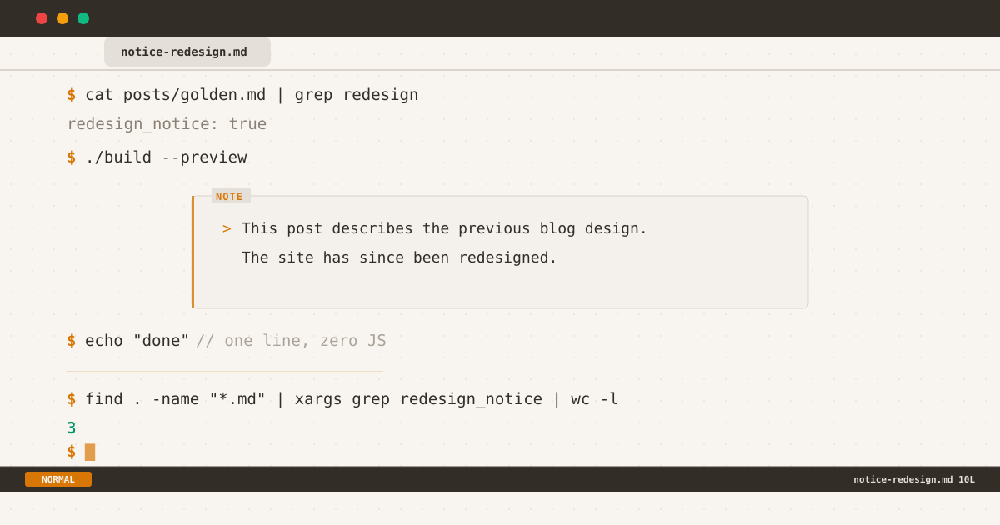

*The redesign notice through three iterations: # prefix, bordered "note" box, and the final amber left-border design.*

Imagine arriving at a blog post about golden ratios in web design. The screenshots show a sidebar layout, a blue accent, and an IBM Plex Sans body font. You look at the live site — monospace font, amber accent, no sidebar. The disconnect is instant. Is the information outdated? Is the post wrong?

That moment of confusion is exactly what happened after this blog's [terminal redesign](/posts/redesign-log-terminal-theme). And it's what led to a tiny piece of UI that taught me more about design iteration than any A/B test ever did.

${toc}

## The Problem

After the revamp, three posts had direct references to the old design:

- **`monogram-s-55x55`** — Entirely about a design element (the "S" monogram at 55×55) that no longer exists.
- **`golden-ratio-web-design`** — Screenshots showing the sidebar layout, the old blue accent, the dot leaders.
- **`dot-leader-pattern`** — A tutorial about dot leaders that the site no longer uses.
- **`reviving-a-ghost`** — Mentions of the S monogram, sidebar, and favicon workflow.

Three of these (`golden-ratio`, `dot-leader`, `reviving-a-ghost`) could be edited — a few paragraphs reframed as historical context, screenshots captioned with "pre-revamp." The remaining post, `monogram-s-55x55`, was fundamentally about a removed feature. Editing it would gut its premise.

But even edited posts have readers who scan without reading captions. They see a screenshot of a blue sidebar on a site with an amber topbar. The question forms: *Is this still correct?*

I needed a way to answer that question before it was asked.

## Requirements

The solution had to meet three constraints:

1. **Per-post opt-in.** Not a global banner. Most posts don't need it. Adding it should take one line.
2. **Visually distinguishable from content.** It should look like a system message, not a paragraph of prose.
3. **Consistent with the terminal theme.** If the rest of the blog uses `$` prompts and `:q` navigation, a corporate "⚠️" callout would be jarring.

No third-party library. No JavaScript. No cookie banners pretending to be something useful. Just a conditional include in a Nunjucks template and a few lines of CSS.

## The Implementation

Small enough to show in full.

**The frontmatter flag:**

```yaml
---
title: "Monogram S 55×55"
redesign_notice: true
---
```

**The conditional include in `post.njk`:**

```html



```

**The partial (`notice-redesign.njk`):**

```html
<div class="notice-redesign">
  <p>This post describes the previous blog design. The site has since been redesigned.</p>
</div>
```

That's the entire pipeline. A frontmatter key, a Nunjucks conditional, a three-line partial. Zero overhead for posts that don't need it. One-line activation for posts that do.

The hard part wasn't the implementation — it took five minutes. The hard part was making it look right. That took three weeks.

## Iterations

### v1 — The `#` Comment

My first instinct was pure terminal: render the notice as `#`-prefixed comment lines, like a config file disclaimer.

```css
/* Style B — comment lines */
.notice-redesign p::before { content: "# "; color: var(--accent); }
```

It looked authentic — like a warning in a `.gitignore` or a `Makefile`. But authenticity doesn't mean effectiveness. The `#` prefix blended into the monospace rhythm. Readers who scan (which is most readers) would skip it. It answered the question, but only if you stopped to read it. In design, *visible* comes before *readable*.

### v2 — The Box

I abandoned the pure terminal approach for a box: a bordered container with an amber "note" label floating on the top-left edge.

```css
.notice-redesign {
  border: 1px solid var(--border);
  border-radius: var(--radius);
  position: relative;
}
.notice-redesign::before {
  content: "note";
  top: -0.45rem;
  left: 0.75rem;
  background: var(--bg);
  color: var(--accent);
  text-transform: uppercase;
}
```

The box worked. It was clearly separate from content, the "note" label signalled its purpose, and the structure scaled to multi-paragraph messages. But one thing nagged: the border used `var(--border)`, a muted gray that works for layout dividers but not for notifications. In light mode it was `#e5e7eb`. In dark mode it was `#2a2a2a`. Both are designed to *disappear* — the exact opposite of what a notice should do.

The box existed, but it didn't *announce* itself.

### v3 — The Left Border

The fix came from an unexpected place: every notification my brain actually notices.

Error messages use a red left border. Warning banners use yellow. Success alerts use green. The pattern is universal — a colored vertical bar on one side signals *this is a different kind of information* without shouting.

I replaced the equal border with a 3px accent left border:

```css
.notice-redesign {
  border: 1px solid var(--border);
  border-left: 3px solid var(--accent);
  border-radius: var(--radius);
}
.notice-redesign p::before { content: "> "; color: var(--accent); }
```

Three pixels of amber transformed the box. The `>` beam prefix tied it back to the terminal theme. The rest of the border faded into the background as it should. The notice finally did what a notice is supposed to do: caught attention without demanding it.

## Takeaways

Three things this process confirmed:

1. **Design decisions need real content to test against.** Theory gives you a starting point. Context gives you the answer. v1 looked great in a vacuum. v1 failed against an actual post.

2. **The most impactful change is often the smallest.** Of everything in this three-week iteration cycle, a single `border-left: 3px` made the difference between "I see a box" and "I notice a notification." Not a new layout. Not a different font. Three pixels on one side.

3. **A system this small teaches you about systems this big.** The same principle that makes a good design system — consistency, intention, iteration — applies whether you're building a 300-line color palette or a 3-line conditional include. The scale changes. The principles don't.

## Back to the Reader

Remember the reader who arrived at the golden ratio post and saw a screenshot of a different blog? With `redesign_notice: true` in the frontmatter, they now see a notice box with an amber left border and a `>` prefix. They read "This post describes the previous blog design. The site has since been redesigned." in three seconds flat. They scroll down, understand the context, and engage with the content.

They never think about the 3px border. They never need to. That's the point.

---

*The full implementation — the CSS, the Nunjucks partial, and this post itself — is [open source on GitHub](https://github.com/tionosulis/tionosulis.github.io).*
