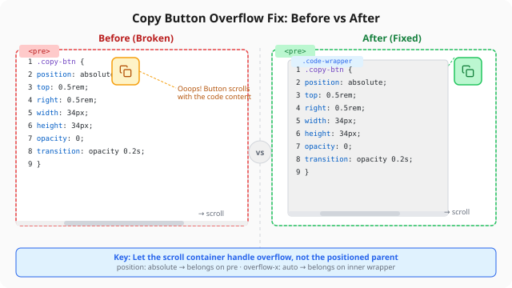

${toc}

## The Bug

Everything worked fine until someone scrolled a code block horizontally.

On hover, the copy button appeared at the top-right corner — exactly where it should be. But when the code was long enough to trigger `overflow-x: auto`, the button drifted. Not far, but enough to look broken. Instead of hugging the top-right corner of the code block, it sat somewhere in the middle.



The button wasn't broken. It was behaving exactly as instructed — just not as intended.

## The Structure

Every code block on this blog is [rendered by Shiki](/posts/shiki-njk-language-not-found/) into this HTML structure:

```html
<pre class="shiki" style="position: relative; overflow-x: auto;">
  <button class="copy-btn">Copy</button>
  <code>...long code...</code>
</pre>
```

The copy button uses `position: absolute` to stay at the top-right corner:

```css
.copy-btn {
  position: absolute;
  top: 0.5rem;
  right: 0.5rem;
}
pre { position: relative; }
```

The `pre` also has `overflow-x: auto` — necessary for long code lines. These two CSS properties seem independent until you test with real content.

## The Root Cause

The interaction between `overflow-x: auto` and `position: absolute` is subtle but well-defined.

When a parent has `position: relative` and `overflow-x: auto`:

1. **The parent becomes a scroll container**. Content inside it can scroll horizontally.
2. **The absolutely-positioned child is positioned relative to the parent's padding box** — the visible area, excluding scrollbars.
3. **But**: absolutely-positioned children of scroll containers still participate in the scroll mechanism. When the parent scrolls, the child scrolls with it.

That third point is the crux. The button isn't wrong — it's at `right: 0.5rem` from the padding box as instructed. But when the user scrolls right to see overflow code, the button's position shifts relative to the viewport because the entire content (including the button) scrolls.

In other words: `position: absolute` removes an element from the normal flow, but it does NOT remove it from the scrollport of an overflowing parent.

## The Fix

The solution is to separate the scroll container from the positioned parent. The `pre` keeps `position: relative` for the absolute button, but loses `overflow-x: auto`. An inner `<div>` handles the scrolling instead:

```html
<pre style="position: relative;">
  <button class="copy-btn">Copy</button>
  <div style="overflow-x: auto;">
    <code>...long code...</code>
  </div>
</pre>
```

```css
pre {
  position: relative;
  /* overflow-x: auto removed */
  padding: 0;                     /* padding moved to wrapper */
}

.code-wrapper {
  overflow-x: auto;
  padding: 1rem 1.25rem;          /* padding lives here now */
}
```

Now the button is positioned relative to the `pre` (which has no overflow), while only the inner wrapper scrolls. The button stays at the top-right corner no matter how far the code scrolls horizontally.

## Implementation in Eleventy

The copy button is injected via an Eleventy build transform. The change was minimal — just wrap the content in a `<div class="code-wrapper">` after the button:

```javascript
// Before: only button
return content.replace(/(<pre[^>]*>)/g, "$1" + copyBtnHtml);

// After: button + scroll wrapper
let result = content.replace(/(<pre[^>]*>)/g, "$1" + copyBtnHtml + '<div class="code-wrapper">');
return result.replace(/<\/pre>/g, '</div></pre>');
```

## What This Taught Me

Every CSS property interacts with its container. `position: absolute` is often taught as "removes from flow," which is true — but only partially. It removes from the normal layout flow, not from the scroll flow. Understanding this distinction turned a two-hour debugging session into a ten-second fix with a clear rationale.

The next time you see a `position: absolute` element that won't stay put inside an overflowing container, remember: the scrollport doesn't care about your layout context. Give it its own container.

---

*The full source of this blog — including this fix — is [on GitHub](https://github.com/tionosulis/tionosulis.github.io).*
