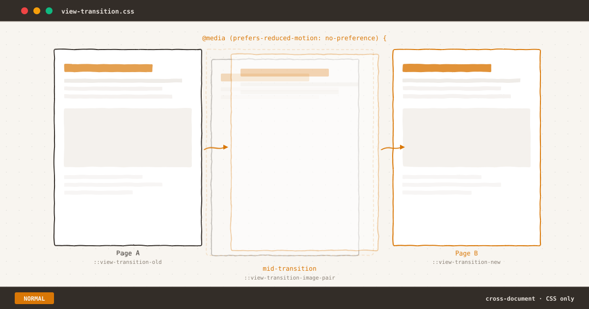
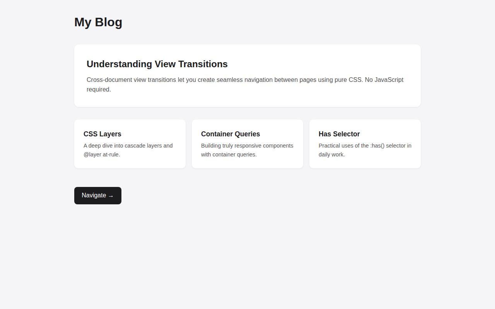
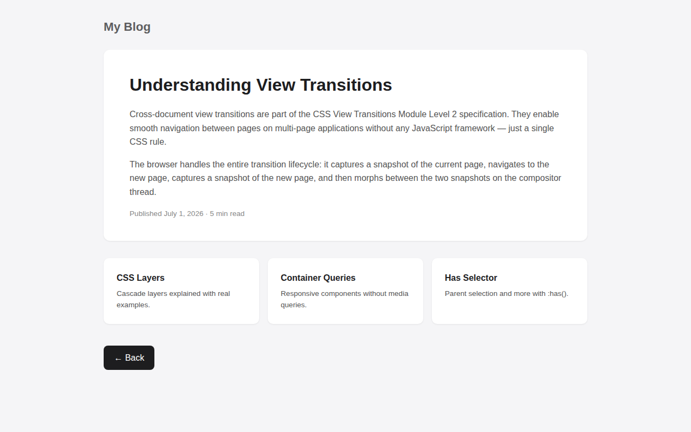
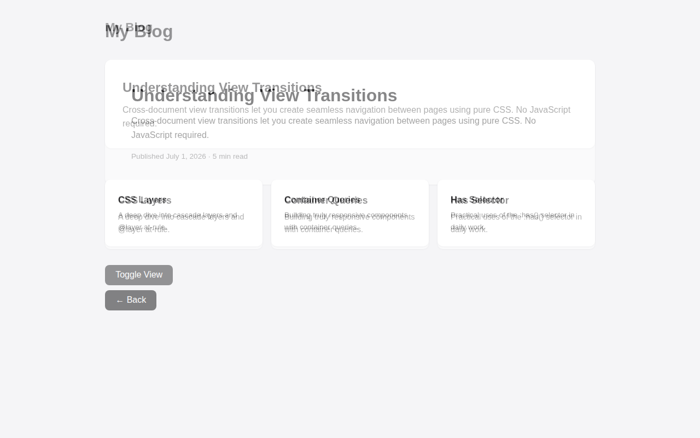

*Page A fades out, Page B fades in — the browser handles the rest with pure CSS.*

`$ man view-transitions`

Every static site shares the same friction point: the moment between clicking a link and seeing the next page. A white flash. A layout shift. That split-second disorientation that makes multi-page apps feel sluggish compared to SPAs.

CSS Cross-Document View Transitions fix this. Not through JavaScript frameworks or client-side routing — through three lines of CSS that turn page navigations into smooth, animated transitions.

This is a technical walkthrough of how they work, how to use them, and what to watch out for.

${toc}

## The Problem



*The starting state: a blog homepage before navigation. Every click on a static site begins from a fully rendered page, then disappears into a white flash.*

Clicking a link on a static site triggers a full page navigation. The browser unloads the current document, renders a blank white screen, fetches the new HTML, parses it, and paints the result. From the user's perspective: content disappears, white flash, content reappears.

This is not a network problem. Even with instant server response, the browser's navigation lifecycle introduces a mandatory visual discontinuity. SPAs solve this by keeping the same document alive and swapping content via JavaScript. But SPAs come with their own costs: JavaScript bundle, client-side routing, accessibility complexity.

The better solution lives in the browser engine itself.

## Minimal Setup

Three lines in any stylesheet:

```css
@view-transition {
  navigation: auto;
}
```

That's it. The browser now captures a screenshot of the current page before navigating, navigates to the new page, captures a screenshot of the new page, and morphs between the two using a default crossfade animation.



*The result after navigation: the same page reached with no white flash — just a smooth compositor-level crossfade that completes in ~300ms.*

The entire transition runs on the compositor thread — separate from the main JavaScript thread. It does not block layout, painting, or user interaction. The crossfade duration is approximately 300ms, matching the browser's natural navigation latency window.

In Eleventy, this single rule goes in your global stylesheet (e.g., `assets/css/index.css`) and applies to every page automatically. No build plugin, no JavaScript, no configuration.

## Custom Morphing with `view-transition-name`

The default crossfade is smooth but uniform. For a more polished experience, you can assign names to specific elements so the browser morphs them individually — matching old and new instances across navigations.

```css
/* Both pages define the same name for the same semantic element */
.site-title {
  view-transition-name: site-title;
}
.featured-article {
  view-transition-name: featured;
}
.post-card {
  view-transition-name: card-1;
}
```

When the user navigates from page A to page B, elements with matching `view-transition-name` values are paired. The browser morphs each pair independently: position, size, and content dissolve from the old state to the new state. Elements without a name (or with names that exist on only one page) simply crossfade.

The rule is simple: **every `view-transition-name` must be unique within a page**. You cannot reuse the same name for multiple elements on the same document.

Level 2 of the spec also introduces `view-transition-class`, which lets you group multiple elements under a single animation name — useful when a card grid or list section shares the same transition behavior without repeating `view-transition-name` values.

## Respecting User Motion Preferences

View transitions are a visual enhancement, not a functional requirement. For users with vestibular disorders or motion sensitivity, the default crossfade — even at 300ms — can cause discomfort.

The `@view-transition` at-rule lives inside the CSS cascade, which means you can wrap it in a media query:

```css
@media (prefers-reduced-motion: no-preference) {
  @view-transition {
    navigation: auto;
  }
}
```

With this wrapper, transitions only activate when the user has not requested reduced motion. Browsers that do not support `@view-transition` ignore the entire block. Browsers that support it but respect `prefers-reduced-motion: reduce` skip the transition and fall back to a standard navigation.

You can also gate by viewport size, network conditions, or any media feature:

```css
@media (prefers-reduced-motion: no-preference) and (min-width: 768px) {
  @view-transition {
    navigation: auto;
  }
}
```

This keeps transitions off narrow screens where the animation feels less natural and consumes more of the viewport budget during navigation.

## How the Browser Runs the Transition

The transition lifecycle has five phases:

1. **Snapshot**: Browser captures the current visual state of every element with a `view-transition-name`, plus the root (background).
2. **Navigate**: Browser unloads the old document and loads the new one. The user waits for the new server response.
3. **Snapshot (again)**: Browser captures the new state of all named elements on the new page.
4. **Merge**: Browser creates a pseudo-element tree under `::view-transition` with both old and new snapshots positioned to match.
5. **Animate**: The default crossfade runs on the compositor. Old snapshots fade out, new snapshots fade in and morph to their final positions.

For programmatic control, the `pageswap` and `pagereveal` events fire before and after the transition lifecycle — useful for analytics, conditional abort, or injecting custom styles per-navigation.



*Mid-transition — the browser blends old and new snapshots frame-by-frame on the compositor thread. At this moment, elements are bitmap captures, not live DOM nodes.*

This pseudo-element tree is accessible via CSS:

```css
::view-transition-old(root) {
  animation-duration: 400ms;
}
::view-transition-new(featured) {
  animation-duration: 600ms;
  animation-timing-function: cubic-bezier(0.22, 1, 0.36, 1);
}
```

You can override any aspect of the animation — duration, easing, delay, keyframes — using standard CSS animation properties on these pseudo-elements.

## Gotchas

### 4-Second Timeout

If the server takes longer than 4 seconds to respond after navigation starts, the browser aborts the transition and falls back to a regular navigation. This applies to the full round-trip: request, server processing, response, and initial render. For most static sites served via CDN, this is not a concern. For server-rendered pages under load, it can cause intermittent transition failures with no error feedback.

### Aspect Ratio Warp

When an element with the same `view-transition-name` has different dimensions on the old and new page, the browser attempts to morph between them by scaling. If the aspect ratios differ significantly, the element appears to stretch through intermediate shapes — a card that expands to twice its width during the animation before snapping to its final dimensions.

```css
/* Mitigation: clamp morph boundaries */
::view-transition-group(featured) {
  animation-timing-function: cubic-bezier(0.22, 1, 0.36, 1);
}
```

### Snapshot, Not Live DOM

During the transition, all elements are bitmap snapshots. They do not respond to `clip-path`, `filter`, or `transform` changes that depend on live layout. If your animation attempts to morph a gradient, a shadow, or a clipped shape, the boundary of the snapshot rectangle animates — not the shape itself.

### LCP Cost

Cross-document view transitions add approximately 70ms to Largest Contentful Paint on mobile devices. This is the time needed to capture the old snapshot before navigation can begin. On fast connections with instant server response, this represents a meaningful fraction of the total page load timeline.

The mitigation is [Speculation Rules](https://developer.chrome.com/docs/web-platform/prerender-pages):

```html
<script type="speculationrules">
{
  "prerender": [{
    "where": { "href_matches": "/*" }
  }]
}
</script>
```

With prerender enabled, the browser loads pages before the user clicks. When navigation happens, the old snapshot captures instantly (no server wait), and the LCP cost drops to near zero. Speculation Rules are supported in Chrome and Edge; Safari and Firefox do not yet implement them.

### Validator False Positives

CSS features ship before validators catch up. The W3C CSS Validator flags `@view-transition`, `::view-transition-old()`, and `::view-transition-new()` as parse errors — but all target browsers (Chrome 126+, Safari 18.2+, Firefox 144+) support them without issue. This blog went from 16 CSS errors to zero with LightningCSS, but features this new pass through unmodified. [From 16 Errors to Zero: How a Build-Time Transform Fixed What the W3C Couldn't](/posts/from-16-to-zero/) covers the pattern.

## Browser Support

| Browser | Cross-Document VT | Speculation Rules |
|---------|------------------|-------------------|
| Chrome 126+ | Full | Full |
| Edge 126+ | Full | Full |
| Safari 18.2+ | Full | None |
| Firefox 144+ | Partial (behind flag) | None |
| Global | ~83.43% | ~72% |

Cross-document view transitions are on the Interop 2026 focus area, meaning browser vendors are actively working toward compatibility. The feature degrades gracefully: browsers that do not support it perform a standard navigation with no visible effect. No polyfill is needed because the transition is a visual enhancement, not a functional requirement.

## Try It Yourself

Open these pages in Chrome 126+, Edge 126+, or Safari 18.2+:

- [Cross-document navigation: Page A → Page B](/demos/view-transitions/page-a.html) — tap "Navigate →" to see a morphing transition between two layouts, powered by `@view-transition { navigation: auto; }`.
- [SPA-style mid-transition (slowed to 2.5s)](/demos/view-transitions/demo-morph.html) — tap "Toggle View" to watch the crossfade and morph at a comfortable pace. Open Chrome DevTools → Elements → `::view-transition` to inspect the pseudo-element tree while the animation is running.

## Summary

```
$ ./checklist --feature view-transitions

[x]  @view-transition { navigation: auto; } in global CSS
[x]  Unique view-transition-name on morphing elements
[x]  ::view-transition-group pseudo-element overrides
[ ]  Speculation Rules for LCP mitigation
[ ]  Test on Slow 3G for 4-second timeout boundary
[ ]  Review aspect ratio of paired elements
[ ]  Verify no duplicate view-transition-names per page

$ _
```

CSS Cross-Document View Transitions are one of those rare features that deliver significant UX improvement for minimal implementation cost. Three lines of CSS eliminate the white flash that static sites have accepted as inevitable for twenty years. The morphing API adds polish without requiring a JavaScript framework, a build step, or a client-side router.

That white flash between pages? It's optional now.
