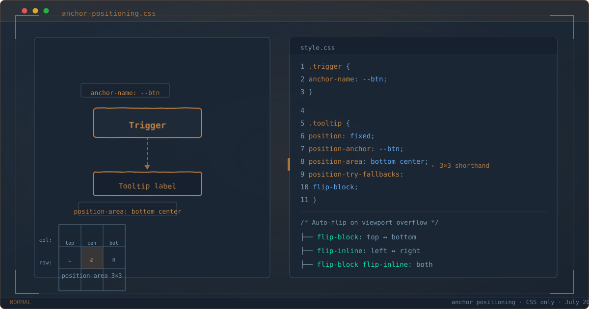

`$ man anchor-positioning`



*Trigger button tethered to a tooltip via CSS anchor positioning — browser handles placement.*

Every frontend developer has written this bug at least once: a tooltip that breaks on scroll, a dropdown that clips at the viewport edge, a popover that detaches from its trigger after resize.

The standard fix has been Floating UI (formerly Popper.js) — a 12KB library that recalculates positions on every scroll event, every resize, and every DOM mutation. It works, but it burns main-thread cycles and adds a dependency for what should be a layout concern.

In 2026, CSS finally handles this natively. CSS Anchor Positioning is Baseline — Chrome 125+, Firefox 147+, Safari 26+. Four CSS properties replace your entire positioning library.

${toc}

## The Old Way

Before anchor positioning, tethering one element to another meant measuring DOM coordinates in JavaScript, recalculating on every scroll, and running a ResizeObserver for good measure:

```js
const trigger = document.querySelector('.trigger');
const tooltip = document.querySelector('.tooltip');

function position() {
  const rect = trigger.getBoundingClientRect();
  tooltip.style.top = rect.top - tooltip.offsetHeight - 8 + 'px';
  tooltip.style.left = rect.left + rect.width / 2 - tooltip.offsetWidth / 2 + 'px';
}

position();
window.addEventListener('scroll', position);
window.addEventListener('resize', position);
```

This pattern has three problems:

1. **Layout thrashing** — every `getBoundingClientRect()` call forces a synchronous layout recalculation.
2. **Main-thread dependency** — scroll handlers compete with rendering for CPU time.
3. **Fragile** — needs ResizeObserver, scroll offset compensation, and responsive breakpoint logic. One missed edge case and the tooltip floats orphaned.

## The Core Recipe

The CSS version marks the trigger as an **anchor**, then positions the tooltip relative to it with the `anchor()` function:

```css
.trigger {
  anchor-name: --tooltip-anchor;
}

.tooltip {
  position: absolute;
  position-anchor: --tooltip-anchor;
  bottom: anchor(top);
  left: anchor(center);
  translate: -50% 0;
}
```

The `anchor()` function accepts two arguments: the anchor's edge (`top`, `bottom`, `left`, `right`, `center`) and an optional percentage offset. The browser handles all the math — scroll position, resize, stacking context — on the compositor thread.

No scroll listeners. No ResizeObserver. No layout thrashing. The tooltip follows its anchor automatically, even when the anchor moves, the page scrolls, or the viewport resizes.

Try it: [Basic tooltip demo](/demos/anchor-positioning/basic-tooltip.html)

## position-area: The 3x3 Shorthand

Writing `bottom: anchor(top); left: anchor(center)` works, but there is a cleaner alternative. `position-area` gives you a 3x3 grid of positioning regions relative to the anchor:

```css
.tooltip {
  position: fixed;
  position-anchor: --tooltip-anchor;
  position-area: top center;
}
```

This places the tooltip above and centered on the anchor. The values combine a row (`top`, `center`, `bottom`) and a column (`left`, `center`, `right`, `span-all`) — 27 distinct positioning regions in one property. The `start`/`end` logical values respect writing direction automatically.

| Value | Position |
|---|---|
| `top left` | Above, left-aligned |
| `top center` | Above, centered |
| `top right` | Above, right-aligned |
| `center left` | Middle, left-aligned |
| `center center` | Centered on anchor |
| `bottom right` | Below, right-aligned |
| `top span-all` | Above, full-width of anchor |
| `bottom span-all` | Below, full-width of anchor |

In practice, `position-area` covers 90% of positioning needs. Reserve the raw `anchor()` function for cases that need precise pixel offsets or percentage-based placement.

Try it: [Position-area playground](/demos/anchor-positioning/position-area.html)

## Auto-Flip with position-try-fallbacks

The first time your tooltip opens near the bottom of the viewport and disappears off-screen, you discover why viewport-edge detection matters. Floating UI calls this "flip middleware." CSS Anchor Positioning has `position-try-fallbacks`:

```css
.tooltip {
  position: fixed;
  position-anchor: --tooltip-anchor;
  position-area: bottom center;
  position-try-fallbacks: flip-block;
}
```

The browser tries `bottom center` first. If the tooltip overflows the viewport, it automatically flips to `top center`. The fallback only activates when the default position does not fit — no wasteful DOM measurements.

Three built-in try tactics:

| Tactic | Behavior |
|---|---|
| `flip-block` | Flips along the block axis (top ↔ bottom) |
| `flip-inline` | Flips along the inline axis (left ↔ right) |
| `flip-block flip-inline` | Flips along both axes |

For most tooltip and dropdown cases, `flip-block` is the only fallback you need.

Try it: [Auto-flip demo](/demos/anchor-positioning/auto-flip.html)

## Custom Fallbacks with @position-try

When the built-in flip tactics are not enough — say you want an offset or a different alignment on overflow — use `@position-try`:

```css
@position-try --tooltip-right {
  position-area: center right;
  margin-inline-start: 8px;
}

.tooltip {
  position: fixed;
  position-anchor: --tooltip-anchor;
  position-area: top center;
  position-try-fallbacks: flip-block, --tooltip-right;
}
```

The browser tries positions in order: `top center` first, then `flip-block` (which evaluates to `bottom center`), then `--tooltip-right` (`center right`). The first position that fits wins.

## Pairing with the Popover API

Anchor positioning handles *position*. The `popover` attribute handles *visibility* — toggling, Escape key dismissal, top-layer stacking, focus management. Together they form a complete zero-JS popup system:

```html
<button popovertarget="menu" style="anchor-name: --menu-anchor">
  Open Menu
</button>

<div id="menu" popover="auto"
     style="position-anchor: --menu-anchor;
            position-area: bottom center;
            position-try-fallbacks: flip-block">
  <a href="#">Edit</a>
  <a href="#">Duplicate</a>
  <a href="#">Delete</a>
</div>
```

```css
[popover] {
  opacity: 0;
  transform: translateY(-4px);
  transition: opacity 0.15s, transform 0.15s;
}

[popover]:popover-open {
  opacity: 1;
  transform: translateY(0);
}
```

The `popover="auto"` attribute makes the menu dismissible on Escape key press and clicks outside. Anchor positioning keeps it tethered to the button. The CSS transition handles entrance animation — all declarative.

Try it: [Popover dropdown demo](/demos/anchor-positioning/popover-dropdown.html)

## Gotchas

### anchor-scope for Reusable Components

In component-based architectures, multiple instances of the same component need distinct anchor names. A shared `anchor-name: --menu-btn` in a stylesheet would collide when the component renders twice. The fix: `anchor-scope` limits name resolution to a subtree:

```css
.menu-wrapper {
  anchor-scope: --menu-anchor;
}
```

Each instance creates its own scope. The name `--menu-anchor` resolves to the nearest ancestor that declares its scope.

### Safari 18.2–18.3 Partial Support

Safari 18.2 shipped the core `anchor()` function but not `position-try-fallbacks` or `@position-try`. If your audience includes users on older Safari, anchor positioning still works — the tooltip appears at the default position without auto-flip. Acceptable as progressive enhancement.

Safari 26+ has full support for all anchor positioning features.

### position-visibility: Hiding Orphaned Tooltips

By default, an anchored element stays visible even when its anchor scrolls out of the viewport. For tooltips this creates a floating orphan — text without context. Use `position-visibility: anchors-visible` to hide the tooltip when its anchor is off-screen:

```css
.tooltip {
  position-visibility: anchors-visible;
}
```

The browser hides the tooltip when the anchor is clipped or scrolled away, and shows it again when the anchor re-enters the viewport.

## The @supports Fallback Pattern

Always wrap anchor positioning in a feature query:

```css
/* Baseline: works everywhere */
.tooltip {
  position: absolute;
  bottom: calc(100% + 4px);
  left: 50%;
  translate: -50% 0;
}

/* Enhanced: anchor positioning when supported */
@supports (anchor-name: --x) {
  .trigger { anchor-name: --tooltip-anchor; }
  .tooltip {
    position: fixed;
    position-anchor: --tooltip-anchor;
    position-area: bottom center;
    position-try-fallbacks: flip-block;
    inset: auto;
    translate: 0 0;
    bottom: auto;
    left: auto;
  }
}
```

For teams that need full parity on older browsers, the [Oddbird polyfill](https://github.com/oddbird/css-anchor-positioning) (~8KB gzipped) adds native-polyfill support with feature detection:

```html
<script>
  if (!CSS.supports('anchor-name: --x')) {
    const s = document.createElement('script');
    s.src = 'https://unpkg.com/@oddbird/css-anchor-positioning';
    document.head.appendChild(s);
  }
</script>
```

Modern browsers download nothing. Legacy browsers get 8KB — a better deal than shipping 12KB of Floating UI to everyone.

### When JavaScript Still Wins

Three cases still need a JavaScript positioning library:

1. **Virtual lists** — positioning relative to a list item that does not exist in the DOM yet.
2. **Cross-shadow-DOM** — anchor positioning is currently scoped to the same shadow tree.
3. **Deeply nested dynamic menus** — menus that re-position based on sub-menu placement.

For everything else, native CSS is the right default.

## Browser Support (July 2026)

| Browser | Core | @position-try | Popover API |
|---|---|---|---|
| Chrome 125+ | Full | Full | Full |
| Edge 125+ | Full | Full | Full |
| Firefox 147+ | Full | Full | Full |
| Safari 26+ | Full | Full | Full |
| Global | ~81–91% | ~81% | ~94% |

Anchor positioning is on the Interop 2026 focus area. The feature degrades gracefully via `@supports` — no polyfill required for basic functionality.

## Try It Yourself

Open these pages in Chrome 125+, Firefox 147+, or Safari 26+:

- [Basic tooltip](/demos/anchor-positioning/basic-tooltip.html) — a tooltip that follows its anchor through scroll and resize, no JavaScript.
- [Position-area playground](/demos/anchor-positioning/position-area.html) — interactive 27-region grid explorer. Click through each position to see how the tooltip moves.
- [Auto-flip](/demos/anchor-positioning/auto-flip.html) — resize the viewport and watch the tooltip flip between top and bottom positions automatically.
- [Popover dropdown](/demos/anchor-positioning/popover-dropdown.html) — complete zero-JS dropdown using `popover` + anchor positioning. Escape key and click-outside dismissal included.

## Summary

```
$ ./checklist --feature anchor-positioning

[x]  anchor-name on trigger element
[x]  position-anchor on positioned element
[x]  position-area for placement (or anchor() for precision)
[x]  position-try-fallbacks for viewport-edge auto-flip
[x]  @supports (anchor-name: --x) wrapper for fallback
[x]  popover API for visibility toggling
[x]  anchor-scope for reusable components
[ ]  Test on Safari 18.x for partial @position-try support
[ ]  Oddbird polyfill if legacy browser coverage needed

$ _
```

CSS Anchor Positioning is one of those rare features that eliminates an entire category of JavaScript code. Four CSS properties replace a 12KB library. Browser-positioned layouts are more reliable than manually-calculated ones. Compositor-thread performance means no main-thread contention.

The pattern is clear: the web platform keeps absorbing patterns that once required JavaScript libraries. [Cross-document view transitions](/posts/cross-document-view-transitions/) follow the same trajectory — replacing client-side routers with three lines of CSS. Anchor positioning is the same story for a different problem: positioning libraries are next.
