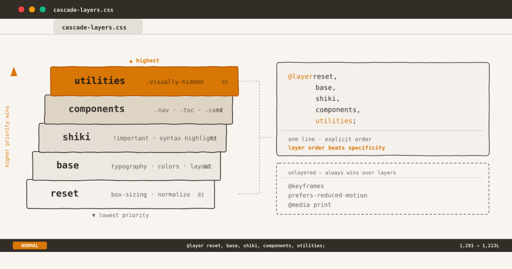

`$ man css-cascade-layers`



*Layer order beats specificity. One declaration line — the entire cascade under control.*

${toc}

## The Specificity Tax

Every CSS codebase that lives long enough eventually collects the same kind of debt: a `!important` here to override a third-party widget, a nested selector there to win a specificity battle, and eventually a stylesheet where the cascade has become a mystery.

This blog's CSS was no different. At 1,291 lines, `content/assets/css/index.css` had:

- Rules targeting `.shiki` with `!important` to override Shiki's inline styles
- A flat `.cursor` class conflicting with the same class in `.posts-page`
- `.copy-btn`, `.code-wrapper`, `.code-statusbar`, `.prompt`, `.status-mode`, `.status-info` defined twice — once in the global scope and once inside `@scope (.shiki)`
- An `:scope` block inside `@scope (.shiki)` duplicating properties already set in the parent `pre` rule
- No clear layering strategy — everything competed at the same cascade level

The CSS worked. But it was fragile. Adding a new component meant navigating a minefield of implicit priorities. One wrong selector and you'd trigger a regression.

`@layer` fixed that.

## What Are Cascade Layers?

Cascade layers let you declare explicit priority order for your style buckets:

```css
@layer reset, base, shiki, components, utilities;
```

This single line — the layer `@import`-style statement — establishes that any rule in `utilities` beats any rule in `components`, which beats `shiki`, which beats `base`, which beats `reset`.

**Within the same layer**, normal cascade rules apply: specificity, source order, `!important` all work as they always have.

**Across layers**, the layer order determines winner — regardless of specificity or source order. A `.visually-hidden` (a utility-layer rule with specificity 0,1,0) beats a `h1` (a base-layer rule with specificity 0,0,1) even if both target the same element, because `utilities` is declared after `base` in the layer order.

This is the key insight: **layers override specificity**.

## The Audit

Before touching any CSS, I mapped every rule group in the file to a conceptual layer:

| Layer | Contents | Conflict points |
|---|---|---|
| `reset` | `box-sizing: border-box` | None — single rule |
| `base` | Custom properties, typography, links, images, code, blockquotes, tables, headings, body chrome | Dark mode `[data-theme="dark"]` blocks |
| `shiki` | Shiki syntax highlighting overrides, light-theme color tweaks | All rules use `!important` — needed isolation |
| `components` | Everything else: `.header-anchor`, `.toc`, `.layout`, `.topbar`, `.theme-toggle`, `.post-exit`, `.notice`, `.home-terminal`, `.tree-listing`, `.curl-block`, `.posts-page`, `.article-page` | `.cursor` collision; `.copy-btn`/`.code-wrapper` duplicates |
| `utilities` | `.visually-hidden` | None — single class |

The ordering wasn't arbitrary: `components` must override `shiki` (some component rules target `.shiki`'s children), `shiki` must override `base` (Shiki's `!important` must beat base typography).

## Layer Assignment

The `@layer` declaration went right after custom properties, before any unlayered styles:

```css
@layer reset, base, shiki, components, utilities;
```

Then each block wrapped in its layer:

```css
@layer base {
  body { ... }
  h1, h2, h3 { ... }
  /* 168 lines of base styles */
}

@layer shiki {
  .shiki {
    font-variant-ligatures: none;
    background-color: var(--syntax-bg) !important;
  }
  /* 25 lines of highlighted overrides */
}

@layer components {
  .header-anchor { ... }
  .toc { ... }
  /* 892 lines of component styles */
}

@layer utilities {
  .visually-hidden { ... }
}
```

No selector changes. No property value changes. Just wrapping existing blocks in `@layer` rules.

## The `!important` Isolation

The biggest win was isolating Shiki's `!important` rules. Shiki generates inline styles on every `<span>`:

```html
<span style="color:#E36209">function</span>
```

To override these for theming, you need `!important`. But `!important` in the global scope can leak into unintended conflicts. Wrapping them in `@layer shiki` ensures they only win against `base` and `reset` — `components` and `utilities` still override them without needing `!important` of their own.

```css
@layer shiki {
  .shiki {
    background-color: var(--syntax-bg) !important;
  }
  [data-theme="dark"] .shiki span:not(.status-mode):not(.status-info) {
    color: var(--shiki-dark) !important;
  }
}
```

The `!important` declarations still exist, but they're confined to the `shiki` layer. Any component style can override them naturally — no `!important` arms race.

## Duplicate Elimination

Before the layer refactor, the flat stylesheet had these duplicates running at the same priority:

```css
/* Global scope — 63 lines */
.copy-btn { ... }
.code-wrapper { ... }
.prompt { ... }
.code-statusbar { ... }
.status-mode { ... }
.status-info { ... }

/* Inside @scope (.shiki) — same selectors, same properties */
@scope (.shiki) {
  & .copy-btn { ... }
  & .code-wrapper { ... }
}
```

I verified every element using these classes on the site is inside `.shiki`. The `@scope` version was proven to match the same elements. Result: 63 lines removed, zero visual change.

Similarly, the `:scope` block inside `@scope (.shiki)` duplicated the `pre` box-shadow and `.shiki` `font-variant-ligatures` — both already set in `@layer base` and `@layer shiki`. Removed.

## The `.cursor` Collision

`.cursor` appeared twice in the original stylesheet:

1. `.posts-page .cursor` — a blinking block cursor on the posts listing page
2. `.cursor` (bare) — a text cursor at the end of each article, inside `.post-exit`

The bare `.cursor` was a collision waiting to happen. Both at the same layer, same specificity (0,1,0 vs 0,1,0), but the latter in source-order won — fragile.

The fix was to scope it to `.post-exit`:

```css
@scope (.post-exit) {
  .cursor {
    color: var(--accent);
    animation: blink 1s step-end infinite;
  }
}
```

Now `.posts-page .cursor` and `.cursor` inside `.post-exit` don't interact. The `@scope` boundary prevents the collision entirely — covered in more detail in [the @scope post](/posts/css-scope).

## What Stays Outside Layers

Not everything moved into a layer. Four categories stayed unlayered:

**1. Global animations:**

```css
@keyframes cursor-blink {
  0%, 100% { opacity: 1; }
  50% { opacity: 0; }
}
```

`@keyframes` are global references — they don't participate in the cascade. Wrapping them in a layer is meaningless.

**2. Reduced-motion override:**

```css
@media (prefers-reduced-motion: reduce) {
  *, *::before, *::after { transition: none; }
}
```

This must win over every component's transitions unconditionally. Unlayered styles beat layered styles by default — exactly what we need for accessibility overrides.

**3. Global focus indicators:**

```css
:focus-visible {
  outline: 2px solid var(--accent);
  outline-offset: 2px;
}
```

Browser UA focus styles are unlayered — if this rule sits inside a layer, the browser's default blue ring wins. Keep it unlayered to guarantee your accent color appears on keyboard focus.

**4. Desktop and print media queries:**

```css
@media (min-width: 768px) { ... }
@media print { ... }
```

These were kept at the bottom of the file, unlayered. They adjust layout chrome and print styles — not specific component behavior that needs layer priority.

This follows the same pattern from [Dark Mode Done Right](/posts/dark-mode-done-right): global overrides stay outside the layer system so they always win.

## Results

| Metric | Before | After |
|---|---|---|
| Total lines | 1,291 | 1,213 |
| `!important` declarations | 8 (scattered) | 6 (isolated in `shiki`) |
| Duplicate rule blocks | 2 | 0 |
| Layers | 0 | 5 |
| Visual regression | — | 0 (verified) |

The build output confirmed: 87 files, 56 images, 0 errors. Same output, cleaner architecture.

## Why @layer Matters in 2026

`@layer` hit Baseline in early 2025 and is now supported in every evergreen browser. No polyfill, no build step, no JavaScript.

The real value isn't theory — it's the discipline it enforces. When every new CSS rule must be consciously placed in a layer, you think about priority before you write the selector. You reach for `!important` less because you can reorder layers instead.

Combined with `@scope` (covered in [my previous post](/posts/css-scope)), CSS now has a complete architectural toolkit:

- **`@layer`** for cross-category priority
- **`@scope`** for component containment
- **Custom properties** for theme and token management
- **`light-dark()`** and `color-mix()` for dynamic color — covered in [From 16 Errors to Zero](/posts/from-16-to-zero)

No build tools required. Just CSS.

## Lessons for Your Own Stylesheet

If you're considering a `@layer` refactor:

1. **Audit before layering.** Map every rule group to a conceptual layer. Identify duplicates, `!important` usage, and collision points first.
2. **Order layers by intent, not specificity.** Ask: "when two rules conflict, which should win?" That determines order.
3. **Isolate third-party overrides.** Wrapping Shiki's `!important` rules in its own layer was the highest-impact change. Same applies for any library or framework CSS you override.
4. **Keep accessibility overrides unlayered.** `prefers-reduced-motion` and forced-colors adjustments must win unconditionally.
5. **Verify with a build.** Run your build pipeline after refactoring, compare output. If there's zero visual regression, you did it right.

```css
/* Start with this: */
@layer reset, base, theme, components, utilities;

@layer reset { /* normalize, box-sizing */ }
@layer base  { /* typography, colors, layout chrome */ }
@layer theme { /* dark mode, high contrast variants */ }
@layer components { /* cards, nav, code blocks, widgets */ }
@layer utilities { /* .visually-hidden, .sr-only, spacing helpers */ }
```

The `!important` in your stylesheet isn't a character flaw — it's a symptom of missing layer architecture.

