`$ man css-scope`



*@scope boundary keeps card selectors contained; donut scoping excludes the footer.*

Every CSS codebase eventually hits the same wall: **the global namespace**.

A utility class meant for one page breaks another. A component refactor spirals into a specificity war. You add a `!important` to override an override, and somewhere a designer twitches.

The industry built conventions and tools to manage this — BEM, CSS Modules, CSS-in-JS, Shadow DOM. Each solves the leak problem, each introduces a new one: verbose HTML, build tooling, runtime cost, or broken cascade.

In 2026, CSS finally has a native solution. `@scope` is Baseline across all major browsers — Chrome 118+, Firefox 146+, Safari 17.4+. Scoped styles without build steps, without naming conventions, without JavaScript.

${toc}

## The Problem: CSS Leaks

CSS is global by default. Any selector can match any element anywhere in the DOM:

```css
.card h3 { font-weight: 600; }
```

This rule applies to **every** `<h3>` inside **any** `.card`, regardless of intent. If another component uses `.card` for a different purpose, the styles collide.

Real-world solutions before `@scope`:

| Approach | How it works | Trade-off |
|---|---|---|
| BEM | `.card__heading--featured` | Verbose class names, convention not enforced |
| CSS Modules | Build-time class hashing | Couples CSS to bundler |
| CSS-in-JS | Runtime style injection | Bundle size, runtime cost |
| Shadow DOM | True DOM isolation | Kills the cascade, requires JS |

None of these are *bad* — they got us this far. But they're workarounds for a language-level feature that was missing for 25 years.

## @Scope Basics

`@scope` restricts selectors to a subtree of the document:

```css
@scope (.card) {
  :scope {
    border: 1px solid var(--border);
    border-radius: 8px;
    padding: 1rem;
  }

  & h3 { font-weight: 600; }
  & p  { color: var(--text-secondary); }
  & img { border-radius: 0.5rem; }
}
```

**How it works:**

- `:scope` targets the scoping root — the `.card` element itself. Specificity is `(0,1,0)`.
- `& h3` desugars to `:is(.card) h3` — zero specificity from the root, `(0,0,1)` for `h3`.
- Everything inside `@scope (.card)` can only match descendants of `.card`.

The critical difference from just using `.card h3`: the scoped rule **cannot leak**. No element outside a `.card` can be matched by selectors inside this block.

### Inline Scope

Without a prelude, `@scope` uses the parent element as the root:

```html
<div class="post-card">
  <style>
    @scope {
      :scope { padding: 1rem; }
      h2 { font-size: 1.25rem; }
    }
  </style>
  <h2>Post Title</h2>
</div>
```

Each `<style>` block scopes to its parent element. Drop the same markup twice on a page — no bleed between instances.

## Donut Scoping

The `to` keyword creates an **exclusion boundary** — a lower limit where styles stop applying:

```css
@scope (.card) to (.card > .card-footer) {
  & p { line-height: 1.7; }
  & a { color: var(--accent); }
}
```

Elements inside `.card-footer` are **excluded** from the scope. The "hole in the donut" is where a nested component takes responsibility for its own styling.

This is unique to `@scope` — no other CSS mechanism lets you define a top boundary (inclusive) and a bottom boundary (exclusive) for where selectors match:

```css
@scope (.media-object) to (:scope > .content) {
  /* Media-object chrome. Inner .content is excluded. */
}
```

**Important caveat:** `@scope` provides **selector isolation, not style isolation**. Inherited properties like `color`, `font-family`, and `font-size` still pass through the donut hole. Only direct selector matching is blocked.

Try it: [@scope demo](/demos/css-scope/card-component.html)

## Proximity: A New Cascade Tier

`@scope` introduces **scoping proximity** to the cascade — a new tiebreaker between specificity and source order:

1. Importance (`!important`)
2. Cascade Layers (`@layer`)
3. Specificity
4. **Scoping Proximity** ← new
5. Source Order

When two `@scope` blocks produce conflicting declarations for the same element, **the rule whose root is closer in the DOM tree wins**:

```css
@scope (.light) {
  :scope { background: #ccc; }
  a { color: black; }
}

@scope (.dark) {
  :scope { background: #333; }
  a { color: white; }
}
```

```html
<div class="light">           <!-- scope root → 1 hop to <a> -->
  <a href="#">Link 1</a>      <!-- → light wins -->
  <div class="dark">          <!-- scope root → 2 hops to <a> -->
    <a href="#">Link 2</a>    <!-- → dark wins (1 hop vs 2) -->
  </div>
</div>
```

Proximity is a **tiebreaker** — it only activates when specificity and layers are equal. It does not override higher specificity.

This makes nested theme switching declarative: the nearest scope root determines the styles, without `!important` or specificity hacks.

## Real-World Refactor: Applied to This Blog

After writing this post, I applied `@scope` to three components in this blog's CSS. Here's what the refactor looks like.

### Homepage Terminal

The homepage terminal has prompt characters, command text, output lines, and a blinking cursor — all grouped under `.home-terminal`:

```css
/* Before: every selector repeats the parent */
.home-terminal .cmd { color: var(--accent); }
.home-terminal .output { color: var(--text-secondary); margin: ...; line-height: 1.8; }
.home-terminal .output a { color: var(--accent); text-decoration: underline; }

/* After: co-located inside @scope */
@scope (.home-terminal) {
  :scope { font-family: "JetBrains Mono", monospace; max-width: 618px; margin: 0 auto; }
  & .cmd { color: var(--accent); }
  & .output { color: var(--text-secondary); margin: ...; line-height: 1.8; }
  & .output a { color: var(--accent); text-decoration: underline; }
  & .blinking-cursor { color: var(--accent); animation: cursor-blink 1.1s step-end infinite; }
}
```

Seven separate global rules consolidated into one self-contained block.

### Code Blocks (Every Post)

More impactful — the blog's syntax-highlighted code blocks appear on every post. The `@scope` block organizes all the scattered styles for `.shiki`, `.code-wrapper`, and `.copy-btn` into a single component boundary:

```css
@scope (.shiki) {
  :scope {
    font-variant-ligatures: none;
    box-shadow: 0 1px 3px color-mix(in srgb, var(--accent) 10%, transparent);
  }
  & .code-wrapper { display: block; padding: 1rem 1.25rem; overflow-x: auto; }
  & code { background: none; padding: 0; }
  & .copy-btn { position: absolute; top: 0.5rem; right: 0.5rem; ... }
  &:hover .copy-btn { opacity: 1; }
  & .copy-btn.copied { opacity: 1; color: var(--accent); pointer-events: none; }
}
```

Global styles for `pre` (background, border, radius) stay as fallback for older browsers — progressive enhancement at work.

The same `@scope` boundary also made it possible to layer terminal-UI elements inside code blocks without selector bloat:

- **Vim status bar** (`.code-statusbar`, `.status-mode`, `.status-info`) — the amber `NORMAL` label and language │ line count info, scoped under `@scope (.shiki)`.
- **`$ cat` prompt** (`.prompt`, `aria-hidden="true"`) — injected before `<code>`, isolated by the same scope boundary.

Without `@scope`, each new element would need manual namespace prefixing (`.shiki .code-statusbar`, `.shiki .status-mode`) or risk style leakage. The scope boundary keeps all code-block chrome self-contained.

Note: the 404 page's `.curl-block` component was intentionally left out of the refactor. Because it uses a `.curl-block--error` modifier to switch accent colors to red (`var(--error)`), the modifier rules need higher specificity than the base — something `@scope`'s zero-specificity `&` can't guarantee when competing with global overrides.

## @scope + & (Nesting) Specificity

Inside `@scope`, `&` and `:scope` behave differently:

| Selector | Specificity | Desugars to |
|---|---|---|
| `& h3` | `(0,0,1)` | `:where(.card) h3` — root contributes zero via `:where()` |
| `:scope h3` | `(0,1,1)` | Class + element |
| Bare `h3` | `(0,0,1)` | Implicit `:where(:scope)` prepended |
| `& &` | Valid | Nested `.card` inside `.card` |
| `:scope :scope` | Invalid | Cannot match root inside root |

With multiple scope roots, `&` picks up the highest specificity:

```css
@scope (#sidebar, .card) {
  & img {
    /* desugars to: :is(#sidebar, .card) img */
    /* specificity = (1,0,0) + (0,0,1) = (1,0,1) */
  }
}
```

## @scope vs BEM vs CSS Modules vs Shadow DOM

| Feature | @scope | BEM | CSS Modules | Shadow DOM |
|---|---|---|---|---|
| Build tools needed | No | No | Yes | No (but JS) |
| Isolation | Selector-based | Convention only | Hashed classes | DOM boundary |
| Donut scoping | Yes | No | No | No |
| Proximity cascade | Yes | No | No | No |
| Runtime cost | 0 KB | 0 KB | ~0 KB | 0 KB |
| Class name style | Natural | Verbose | Auto | Natural |
| Inheritance leakage | Yes (by design) | Yes | Yes | No (full wall) |
| Global cascade leaks in | Yes (by design) | Yes | Yes | No |

**When to use what:**

- **BEM** still works fine for small projects or when you want zero dependencies without caring about selector length.
- **CSS Modules** are great when you're already on a build step and want hashed isolation.
- **Shadow DOM** is the right choice for third-party widgets where hard encapsulation matters.
- **@scope** fits **everything in between** — component-based architectures, design systems, static sites, and server-rendered apps where you want scoped styles without tooling overhead.

The practical byte count from a card component benchmark:

| Approach | CSS bytes | HTML bytes | Total |
|---|---|---|---|
| BEM | 412 | 524 | 936 |
| CSS Modules | 318 | 380 + JSX | ~700 + build |
| **@scope** | **286** | **286** | **572** |

## @scope + @layer for Design Systems

`@scope` determines **what** is styled; `@layer` determines **why**:

```css
@layer components, overrides;

@layer components {
  @scope (.card) {
    :scope { border: 1px solid var(--border); }
    header { color: var(--text-bright); }
  }
}

@layer overrides {
  .card header { color: var(--accent); }
}
```

Layer order beats proximity — `@layer overrides` wins regardless of closeness. This gives design systems predictable override behavior: base styles in low-priority layers, overrides in higher layers, all scoped to their components.

## Progressive Enhancement

Write fallback-first, then enhance:

```css
/* Fallback: works everywhere */
.card .title { font-size: 1.25rem; }

/* Enhancement: true scope for modern browsers */
@supports at-rule(@scope) {
  @scope (.card) {
    .title { font-size: 1.25rem; }
  }
}
```

The `@supports at-rule(@scope)` syntax is still settling — for now, `@supports (selector(:scope))` is more widely supported as a feature query.

Without the `@supports` wrapper, `@scope` is **progressive by nature**: an unrecognized at-rule is silently ignored by older browsers, leaving the fallback selectors in place. The double declaration is harmless — both rules have equal specificity, and in supporting browsers the scoped version wins via proximity.

One practical side effect of adopting bleeding-edge CSS: the W3C CSS Validator flags `@scope` (along with `@view-transition` and `::view-transition-*`) as unrecognized at-rules. This is a **validator gap**, not a browser gap — all target browsers support these features. This blog went from 16 CSS errors to zero with LightningCSS, but features this new pass through unmodified because no downleveling exists yet. [From 16 Errors to Zero](/posts/from-16-to-zero/) documents the approach.

## Browser Support

`@scope` is **Baseline Newly Available** since December 2025 (~91% global coverage):

| Browser | Since |
|---|---|
| Chrome | 118 (Sep 2023) |
| Edge | 118 (Sep 2023) |
| Safari | 17.4 (Mar 2024) |
| Firefox | 146 (Dec 2025) |

All major browsers ship it. No flags, no prefixes.

## Summary

`@scope` solves a 25-year-old gap in CSS — native style scoping without tools, conventions, or JavaScript. The key features:

- **Scope boundaries** — `@scope (.component) { ... }` locks selectors to a subtree
- **Donut scoping** — `@scope (...) to (...) { ... }` excludes nested subtrees
- **Proximity** — closer scope roots win, making nested themes declarative
- **Zero runtime** — pure CSS, no bytes added to your bundle
- **Progressive enhancement** — fallback selectors work in older browsers

The web platform finally has a built-in answer to CSS leaks. No more `!important` chains, no more BEM convention manuals, no more build-plugin configuration. Just `@scope` — and your styles stay where you put them.
