*The three pillars of a bulletproof dark mode system: zero-flicker rendering, token-based CSS architecture, and edge-case polish.*

Dark mode is table stakes for modern websites. Yet most implementations have a fatal flaw: the flash of wrong theme — a brief burst of blinding white before JavaScript kicks in and sets things right. It's the kind of bug that users feel even if they can't name it.

There's also a spectrum of quality. Some sites manage persistence (remembering your choice). Others respect system preference. Few do all three: instant correct render, persistence, and system-aware defaults. Fewer still handle the tiny UX details that separate good from great.

This post walks through my dark mode implementation — the one you're probably using right now. It's not complicated, but every line earns its keep.

## The Zero-Flicker Trick

The root cause of dark mode flicker is timing. If you wait for the DOM to load, for CSS to parse, or for a framework to hydrate, you've already lost — the browser has painted the first frame.

The fix is brutally simple: run your theme logic in a `<script>` tag in `<head>`, before the stylesheet loads.

```html
<!DOCTYPE html>
<html lang="en">
<head>
  <script>
    var t = localStorage.getItem("theme");
    if (!t) {
      t = window.matchMedia("(prefers-color-scheme:dark)").matches
        ? "dark" : "light";
    }
    document.documentElement.setAttribute("data-theme", t);
  </script>
  <link rel="stylesheet" href="/styles.css">
</head>
```

Here's the sequence of events:

1. Browser starts parsing HTML
2. Hits the `<script>` tag — runs it synchronously
3. Reads `localStorage`, falls back to `prefers-color-scheme`
4. Sets `data-theme` on `<html>`
5. Browser continues parsing, eventually hits `<link rel="stylesheet">`
6. CSS loads and evaluates with the correct `[data-theme]` value — `color-scheme` included, so native UI (scrollbars, form controls, selection colors) matches from the first paint

The script runs before any CSS applies. There's no repaint, no flicker, no flash of wrong theme.

That's it. A single inline script, minified to about 170 bytes. No framework, no JavaScript library, no runtime dependency after page load.

## CSS Variable Architecture

With the toggle attribute in place, the stylesheet defines two sets of custom properties at `:root`. The `color-scheme` declaration on each block is critical — it tells the browser which native scheme is active, so native elements (scrollbars, form controls, selection highlights) follow the theme:

```css
:root {
  color-scheme: light;
  --bg: #f8f5f0;
  --text: #1b1e23;
  --accent: #B45309;
  /* ... more variables */
}

[data-theme="dark"] {
  color-scheme: dark;
  --bg: #1A1A1A;
  --text: #E0E0E0;
  --accent: #FBBF24;
  /* ... more variables */
}
```

Every color in the stylesheet is a `var(--*)` reference. Changing themes is a single attribute swap — CSS cascades the new values everywhere without a repaint of the page layout. The browser only repaints color, which is the cheapest kind of repaint.

### The System Preference Safety Net

There's one edge case: what if JavaScript is disabled? Or what if `localStorage` throws (some browsers block it in private mode)?

A `@media (prefers-color-scheme)` rule handles this:

```css
@media (prefers-color-scheme: dark) {
  :root:not([data-theme]) {
    --bg: #0a0a0b;
    --text: #d6d6da;
  }
}
```

The `:not([data-theme])` selector ensures this only applies when the script hasn't set a data attribute — either because it failed or was blocked. If the script succeeds, the `[data-theme="dark"]` rule takes priority by specificity and the media query is ignored.

This two-layer approach means the site renders correctly in dark mode 100% of the time, regardless of browser security settings, script blockers, or network failures.

## Persistence Logic

The persistence strategy is straightforward:

1. On first visit: read the system preference via `matchMedia` and apply it
2. When user toggles: save the choice to `localStorage`
3. On subsequent visits: `localStorage` takes priority over system preference
4. To reset: clear `localStorage` (or we could add a "reset to system" option)

This gives users the best of both worlds. The site automatically matches their OS setting on first visit, but a manual override persists across sessions. If someone reads in bed at night with dark mode enabled, it stays dark the next morning.

### Toggle Implementation

The toggle button reads the current `data-theme` attribute, inverts it, saves the choice, and updates the UI labels. The native color scheme follows from CSS automatically:

```javascript
function toggleTheme() {
  var html = document.documentElement;
  var current = html.getAttribute("data-theme");
  var next = current === "dark" ? "light" : "dark";
  var toggleEls = document.querySelectorAll(".theme-toggle,.theme-toggle-posts");
  html.setAttribute("data-theme", next);
  localStorage.setItem("theme", next);
  toggleEls.forEach(function(el) {
    el.querySelector(".toggle-label").textContent =
      next === "dark" ? "--light" : "--dark";
  });
}
```

Beyond the attribute swap and `localStorage` save, one thing happens:

1. **Label update** — every toggle button on the page updates its text to show the *action* the user just took. When switching to dark mode, the label shows `[--light]` (click to switch to light). This is the action-based label pattern (detailed below).

That's the entire toggle — there's no `colorScheme` juggling. An earlier version of this function also set `html.style.colorScheme` with a 200ms delay, trying to sync native UI with the CSS transition. That timer was a workaround that had to guess when the transition ended. The current version drops it entirely: `color-scheme` now lives in CSS, so the browser swaps scrollbars and form controls the moment the `data-theme` attribute changes. Details in Native UI Sync below.

## Action-Based Labels

The label pattern replaces the common icon approach (`🌙`/`☀️`) with a design that shows actions instead of state:

```html
<button class="theme-toggle" aria-label="Toggle theme">
  <span class="toggle-bracket">[</span>
  <span class="toggle-label">--dark</span>
  <span class="toggle-bracket">]</span>
</button>
```

The label is set to the *target* state, not the current one. When it's dark mode, the label says `[--light]` — click here to switch to light. When it's light mode, it says `[--dark]`.

An icon approach (`🌙` = "it's dark mode") requires the user to map the icon to the action. The bracket label removes that cognitive step entirely: it tells you what will happen when you click. It's two characters of affordance that replace an entire reasoning chain.

The initialization script (right after `toggleTheme()` is defined) sets the label based on the current `data-theme`:

```javascript
document.querySelectorAll(".theme-toggle,.theme-toggle-posts")
  .forEach(function(el) {
    el.querySelector(".toggle-label").textContent =
      document.documentElement.getAttribute("data-theme") === "dark"
        ? "--light" : "--dark";
  });
```

This runs before the user has ever interacted with the toggle, ensuring the initial label matches the OS-determined theme.

## Native UI Sync

The `color-scheme` CSS property controls how the browser renders native UI elements — scrollbar thumbs, form control highlights, text selection backgrounds, and the `@media (prefers-color-scheme)` value that `<input>` and `<textarea>` elements read internally.

The current stylesheet declares a scheme per theme state:

```css
:root {
  color-scheme: light;
  /* ... variables ... */
}

[data-theme="dark"] {
  color-scheme: dark;
  /* ... variables ... */
}
```

No JavaScript required. When the toggle (or OS listener) swaps `data-theme`, the CSS cascade applies the matching `color-scheme` in the same pass — native UI follows the attribute the moment it changes.

This wasn't always the case. The original implementation set `colorScheme` from JavaScript — on load in the inline script, and on toggle with a **200ms delay**:

```javascript
setTimeout(function() {
  html.style.colorScheme = next;
}, 200);
```

The delay existed because the page has a global `0.2s ease` transition on colors. If `colorScheme` changed at the same instant, native UI would snap while page colors were still transitioning — a visible half-second of desync. The timer approximated when the transition ended.

Moving `color-scheme` into CSS was a simplification *and* a fix: no timing guess, no extra property for JavaScript to manage, one less thing that can drift. The native UI rides the same cascade as everything else.

## Toggle-Time Flicker (the Quiet Kind)

The zero-flicker trick handles the initial load, and the bfcache guard (below) handles navigation. But there's a third kind of flicker — one that happens *while* the theme transition itself is running.

Every element with a border or glow reads `var(--border)` or `var(--img-glow)` during the transition. If that element has no background of its own, whatever sits behind it — usually the page `--bg` — shows through the changing border, and the element visibly flashes against the old theme.

On this blog, three elements were the worst offenders: the table of contents, the notice banner, and hero images (whose amber glow uses `color-mix` against the accent). The fix:

```css
img {
  background-color: var(--bg);
  transition: box-shadow 0.2s ease !important;
}

.toc,
.notice {
  background-color: var(--bg);
  isolation: isolate;
}
```

An explicit `background-color: var(--bg)` makes each element carry its own theme-aware surface instead of letting the page background show through the border mid-transition. `isolation: isolate` contains the glow's blend context. The hero additionally pins `box-shadow` to the same 0.2s easing as everything else so the glow doesn't snap.

It's invisible when it works — which is exactly the point. Mostly. One honest caveat: on Chrome for Android the TOC can still flash its border white mid-transition — the per-item left rails more than the box. The hero and notice are fully fixed; the TOC is a rendering quirk I haven't pinned down, and I haven't confirmed it in other browsers. It's cosmetic — nothing shifts — and it's tracked for a deeper dive.

## OS Preference Listener

When the user changes their system dark/light setting (e.g., toggling macOS appearance), a `matchMedia` listener keeps the blog in sync:

```javascript
window.matchMedia("(prefers-color-scheme:dark)")
  .addEventListener("change", function(e) {
    var t = e.matches ? "dark" : "light";
    var toggleEls = document.querySelectorAll(".theme-toggle,.theme-toggle-posts");
    document.documentElement.setAttribute("data-theme", t);
    localStorage.setItem("theme", t);
    toggleEls.forEach(function(el) {
      el.querySelector(".toggle-label").textContent =
        t === "dark" ? "--light" : "--dark";
    });
  });
```

No `colorScheme` handling needed here either — the declaration lives in CSS, so the native UI follows the `data-theme` attribute automatically.

Important behavior note: once the user manually toggles, `localStorage` has a value. On subsequent page loads, the init script reads `localStorage` first, so the OS setting is no longer authoritative. The only way to reset to system preference is to clear `localStorage`.

## bfcache Restore

The "no runtime dependency after page load" claim has one blind spot: bfcache (Back-Forward Cache). When a user navigates back, the browser may restore the page from an in-memory snapshot — the inline `<head>` script does NOT re-execute. If the user toggled the theme, navigated away, and came back, the DOM snapshot has a stale `data-theme` while `localStorage` has the updated value.

The fix runs on `pageshow`:

```javascript
window.addEventListener("pageshow", function(e) {
  if (!e.persisted) return;
  var t = localStorage.getItem("theme");
  if (!t) {
    t = window.matchMedia("(prefers-color-scheme:dark)").matches
      ? "dark" : "light";
  }
  document.documentElement.classList.add("no-transition");
  document.documentElement.setAttribute("data-theme", t);
  // ... update labels, colorScheme ...
  requestAnimationFrame(function() {
    requestAnimationFrame(function() {
      document.documentElement.classList.remove("no-transition");
    });
  });
});
```

The `no-transition` class suppresses the global `0.2s` CSS transition to prevent a visible flash of the wrong theme being "corrected" on screen:

```css
html.no-transition,
html.no-transition *,
html.no-transition *::before,
html.no-transition *::after {
  transition: none !important;
}
```

The double `requestAnimationFrame` ensures the class exists for approximately 16ms — long enough to apply the correct theme without any animated transition, but short enough to not interfere with subsequent interactions.

*This fix is detailed further in [The Theme That Couldn't Remember](/posts/theme-that-couldnt-remember/).*


## Syntax Highlighting in Both Themes

My implementation uses Shiki with a dual-theme configuration — `github-light` and `github-dark` — applied via `@shikijs/markdown-it`.

Shiki outputs two sets of styles in the HTML:

```html
<pre class="shiki github-light">
  <code><span style="color:#...">code here</span></code>
</pre>
<pre class="shiki github-dark" style="display:none">
  <code><span style="color:#...">code here</span></code>
</pre>
```

The dark mode CSS toggles which one is visible:

```css
[data-theme="dark"] .shiki.github-light { display: none; }
[data-theme="dark"] .shiki.github-dark { display: block; }
```

There's also a `@media (prefers-color-scheme: dark)` fallback for the no-script case. After the Chasing 100 post, I also had to adjust specific Shiki token colors to meet WCAG AA contrast (4.5:1) — orange `#E36209` became `#A84400`, red `#D73A49` became `#C92E3D`.

## Why Not CSS-Only? (The Temptation)

There's a seductive approach that uses `prefers-color-scheme` exclusively, without JavaScript:

```css
:root { --bg: #f8f5f0; /* light */ }
@media (prefers-color-scheme: dark) { :root { --bg: #0a0a0b; } }
```

This gives you automatic dark mode with zero JavaScript. It's clean, accessible, and respects user preference.

But it can't do two things:
1. **Persist a user choice** — once you toggle, the page must remember
2. **Override system per-site** — the user might want dark mode on this blog and light mode on another

A CSS-only approach is fine for a landing page. For a blog where users spend minutes — sometimes hours — reading, persistence and choice are essential. The inline script is the minimum viable increment over CSS-only.

## Lessons Learned

- **Inline scripts are fast.** 170 bytes. Less than a single HTTP request. The performance impact is literally unmeasurable on modern hardware.
- **`localStorage` before `matchMedia`.** The saved preference always wins. System preference is the default, not the dictator.
- **`@media` fallback is non-negotiable.** Script blockers exist. Private browsing exists. Airplane mode exists. The CSS fallback handles them all silently.
- **Label actions, not states.** The bracket label `[--dark]`/`[--light]` removes the cognitive step of mapping an icon to an action. It tells the user what will happen, not what is.
- **Accessibility is continuous.** Even with a "correct" dark mode, token colors in syntax highlighting can fail contrast checks. Measure everything.

The entire dark mode system on this blog — inline script, CSS variables, persistence, toggle, bracket labels, Shiki integration, OS listener, bfcache guard, WCAG overrides — is about 80 lines of code total. For a feature that touches every page view, that's a reasonable tradeoff.

This system keeps evolving — the warm-neutral palette, the CSS-driven `color-scheme`, and the toggle-time flicker guard above all landed as part of the ongoing redesign chronicled in [$ cat ~/redesign-log](/posts/redesign-log-terminal-theme/). The architecture stays; the details keep getting simpler to run.

[What does your dark mode implementation handle? I'd love to hear about it.]({{ metadata.url }}/about/)
