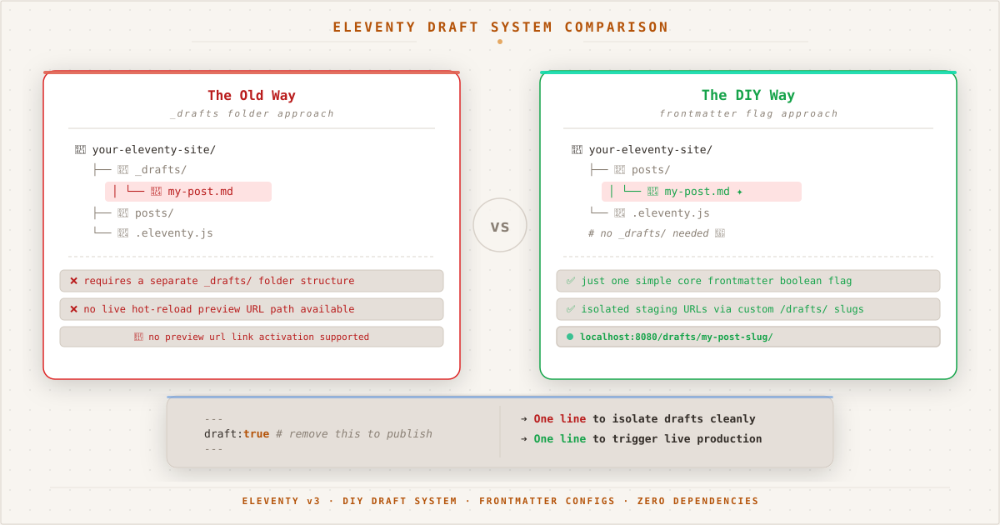

*Two approaches to Eleventy drafts: the traditional `_drafts` folder with extra config, and the frontmatter flag approach with live preview URLs and zero plugins.*

${toc}

## The Problem

Every blogging platform has drafts — unpublished posts that only the author can see. WordPress has them, Ghost has them, even Jekyll has `published: false`. But Eleventy v3? Nothing built-in.

In Eleventy v2, you could rely on the `future` option to skip posts with future dates. In v3, that option doesn't exist. Every post in your `content/` directory is fair game, regardless of its date.

This became painfully obvious when I scheduled a post for tomorrow, deployed, and found it live immediately. A blog without draft support is a blog where every mistake is instantly public.

## The Requirements

I wanted a draft system that checks three boxes:

1. **Zero public visibility** — drafts must not appear in any list, feed, tag page, or sitemap
2. **Previewable** — I should be able to visit a draft's URL directly to proofread
3. **One-step publish** — no file moving, no folder renaming, just flip a switch

## The Implementation

Eleventy v3 provides all the hooks you need. The solution uses two official APIs working together.

### Step 1: Conditionally Reroute the Permalink

The `permalink` function in a data file can access frontmatter. When `draft: true`, we route the post to a `/drafts/` path instead of `/posts/`:

```javascript
// content/posts/posts.11tydata.js
export default {
  tags: ["posts"],
  layout: "layouts/post.njk",
  permalink: ({ draft, page }) =>
    draft ? `/drafts/${page.fileSlug}/` : `/posts/${page.fileSlug}/`,
  // ...
};
```

This means a draft lives at `/drafts/my-post/` while a published post lives at `/posts/my-post/`. The URL changes automatically when you toggle the `draft` flag.

### Step 2: Exclude from All Collections

The `eleventyExcludeFromCollections` property removes an item from every single collection — the `posts` collection, tag-specific collections like `collections.eleventy`, and even `collections.all`. Without this, a draft would still appear on tag pages and in the RSS feed.

But `eleventyExcludeFromCollections` is a static boolean. To make it dynamic based on frontmatter, we use `eleventyComputed`:

```javascript
// content/posts/posts.11tydata.js
export default {
  // ...
  eleventyComputed: {
    eleventyExcludeFromCollections: ({ draft }) =>
      draft ? true : undefined,
    ignore: ({ draft }) =>
      draft ? true : undefined,
  },
};
```

The function returns `true` only when `draft: true`. Otherwise it returns `undefined`, leaving the default behavior intact.

### Step 3: Prevent Search Engine Indexing

A draft at `/drafts/slug/` is accessible to anyone who knows the URL. Without protection, a search engine that finds the URL (via an external referrer or direct link) could index it before you're ready to publish.

Eleventy's `eleventyExcludeFromCollections` only hides drafts from your site's navigation — it doesn't tell search engines to stay away. For that, we need a `<meta name="robots" content="noindex">` tag in the `<head>` of draft pages.

The blog's layout template (`base.njk`) already has this:


```jinja-html
<meta name="robots" content="noindex">
```


The missing piece is setting `ignore: true` on draft pages. We wire it through the same `eleventyComputed` block:

```javascript
// content/posts/posts.11tydata.js
export default {
  // ...
  eleventyComputed: {
    eleventyExcludeFromCollections: ({ draft }) =>
      draft ? true : undefined,
    ignore: ({ draft }) =>
      draft ? true : undefined,
  },
};
```

Now every draft page outputs `<meta name="robots" content="noindex">`. Published pages don't — the variable is `undefined`, so `` evaluates to `false` and the tag is omitted.

This is defense in depth: no internal links, no sitemap entry, and an explicit noindex directive. Search engines would have to discover the URL externally and deliberately ignore the `noindex` tag to index a draft.

### The Complete Data File

Here's the full `posts.11tydata.js` that powers every post on this site:

```javascript
export default {
  tags: ["posts"],
  layout: "layouts/post.njk",
  permalink: ({ draft, page }) =>
    draft ? `/drafts/${page.fileSlug}/` : `/posts/${page.fileSlug}/`,
  eleventyComputed: {
    eleventyExcludeFromCollections: ({ draft }) =>
      draft ? true : undefined,
    ignore: ({ draft }) =>
      draft ? true : undefined,
  },
};
```

Twelve lines. No plugins. No external dependencies.

## How Publishing Works

To write a new draft, add `draft: true` to the frontmatter:

```yaml
---
title: "My Upcoming Post"
date: 2026-06-20
draft: true
tags: [some-topic]
---
```

When you build or deploy, the post is:

| Aspect | Behavior |
|---|---|
| File location | `/drafts/my-upcoming-post/` |
| Homepage | Hidden |
| Tag pages | Hidden |
| RSS feed | Hidden |
| Next/prev nav | Hidden |
| Sitemap | Hidden |
| Direct URL access | ✅ Works |
| Search engine indexing | `noindex` via `<meta name="robots">` |

To publish, delete the `draft: true` line, commit, and push:

```bash
git add content/posts/my-upcoming-post.md
git commit -m "Publish: My Upcoming Post"
git push
```

The post moves from `/drafts/` to `/posts/` and appears everywhere it should. No files to move, no folders to rename, no config toggles to remember.

## Why Not `_drafts` Folder?

Eleventy v3 (and v2) automatically ignores any directory starting with an underscore. A `content/_drafts/` folder works without any configuration — files inside it are never processed.

But the folder approach has tradeoffs:

| Aspect | `_drafts/` folder | `draft: true` frontmatter |
|---|---|---|
| Setup | Zero config | 12 lines in data file |
| Preview | Impossible (no URL) | ✅ `/drafts/slug/` |
| SEO safety | Not rendered — no risk | `noindex` via eleventyComputed |
| Publish | `git mv` between folders | Delete one line |
| Content organization | Split across two folders | All posts in one place |
| Accidental publish | File move = publish risk | Toggle is explicit |

For a blog where I write on my phone and want to preview before publishing, the frontmatter approach wins. The preview URL alone saves me from countless broken drafts.

## What About Scheduled Publishing?

The current system requires a manual step to publish. For automated scheduling — write a post, set a date, and have it go live automatically — you'd need a CI/CD cron job that checks dates and conditionally removes `draft: true`.

That's possible with GitHub Actions, but it adds complexity. For now, a manual `git push` on the publish date is a ritual I don't mind. There's something satisfying about flipping the switch yourself.

---

*This entire site is open source on [GitHub](https://github.com/tionosulis/tionosulis.github.io). The draft system is in `content/posts/posts.11tydata.js` — fork it, tweak it, make it yours. Complementary reading: [the pinning framework](/posts/pinned-content-framework) that pairs with this draft system.*
