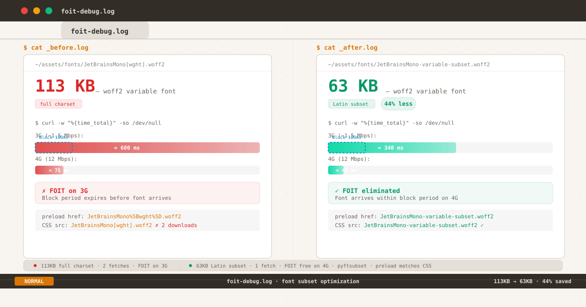

*Before-after: 113KB JetBrains Mono vs 63KB subset, with download times, FOIT windows, and preload matching.*

I spent an afternoon measuring a flash that nobody could see.

Not because the flash was too fast — it wasn't. On a 3G connection, the font took ~600ms to load. That's half a second of invisible text. Long enough to register, if you were looking for it. But the PageSpeed score was green, the LCP was under 2.5 seconds, and no reader had ever mentioned it.

The objective case for fixing it was weak. The subjective case was harder to articulate: text is the entire interface of this blog. If the text rendering has a seam — even a 340ms seam that appears only on the first visit — that seam exists in the experience.

This post is the story of what I found when I chased that seam. It turned out to be two problems, not one. And the second problem was entirely of my own making.

---

## The Block Period

To understand FOIT, you need to understand `font-display`.

When a browser encounters a `@font-face` rule referencing a font that isn't downloaded yet, it has a choice: render the text immediately using a fallback system font, or hold the text invisible while the font downloads. The CSS Fonts Module Level 4 defines four behaviors through the `font-display` descriptor:

| Value | Block Period | Swap Period | Failure |
|---|---|---|---|
| `block` | ~3s | Infinite | Never |
| `swap` | ~100ms (0ms in Chrome) | Infinite | Never |
| `fallback` | ~100ms | ~3s | After swap period |
| `optional` | ~100ms | None | After block period |

The block period is the window during which the browser **blocks** text rendering — holding the text invisible — while the font downloads. If the font arrives within that window, the text appears in the correct typeface with no visible transition. If the font arrives after, the text has already been shown in the fallback font, and the browser swaps to the custom font when it arrives (FOUT — Flash of Unstyled Text).

**`font-display: swap`** is the most common choice — used by ~50% of sites, per the HTTP Archive Web Almanac 2025. The spec defines its block period as "extremely small" (~100ms). In practice, **Chrome has used a 0ms block period since the initial implementation** — a known spec violation documented in Chromium issue 383078471. Firefox and Safari follow the spec's ~100ms recommendation.

This blog uses `font-display: swap`. On Chrome, that means the fallback font is shown instantly (0ms block). On Firefox and Safari, text is invisible for up to 100ms before the fallback appears. Either way, if the custom font download exceeds the block period, a swap happens — and that swap introduces **Cumulative Layout Shift (CLS)** when the fallback and custom fonts have different metrics.

The block period isn't the only variable. Font size matters too.

## The 113KB Problem

JetBrains Mono is a variable font — a single file that contains all weights from 100 to 800. The full woff2 file is 113KB.

On a typical connection:

| Connection | Speed | 113KB Download Time | Exceeds Block Period? |
|---|---|---|---|
| Fast 3G (~1.5 Mbps) | ~600ms | ✅ Yes | 
| 4G LTE (~12 Mbps) | ~75ms | ❌ No (unless ~100ms in Firefox) |
| 4G LTE ideal (~50+ Mbps) | ~18ms | ❌ No |
| DevTools "Slow 3G" (~750 Kbps) | ~1200ms | ✅ Yes |

On 3G, the gap is wide: 600ms download vs 100ms block period. The text sits invisible for half a second before flashing to the fallback, then swaps again when the font arrives. On 4G, the gap narrows — 75ms is just under the ~100ms block period in Firefox/Safari, but Chrome shows the fallback immediately (0ms block) and swaps when the font arrives.

The result is inconsistent: some visitors see a FOIT, some see a FOUT, some see nothing at all. The experience depends on network speed, browser, and cache state.

This is the kind of problem that's easy to ignore because it doesn't affect everyone. But it affects someone. And for a site where every design decision revolves around text, "sometimes invisible" is not an acceptable state.

## Discovery Through Waterfall

I opened PageSpeed Insights and looked at the network waterfall. The font download was visible as a long tail in the critical rendering path. Then I noticed something odd: the waterfall showed **126KB** of font data, not 113KB.

Two requests for the same font. Both succeeded. The browser downloaded the font twice — 113KB for the initial load, plus another 13KB (the remainder of a second incomplete request that was cut short by cache).

Why?

The preload tag in the HTML used percent-encoded brackets:

```html
<link rel="preload" href="/fonts/JetBrainsMono%5Bwght%5D.woff2" as="font" crossorigin>
```

But the CSS `@font-face` used literal brackets:

```css
src: url("/fonts/JetBrainsMono[wght].woff2") format("woff2-variations");
```

The browser treats these as **different URLs**. The preloaded font is never matched against the CSS rule. When the CSS parser encounters the `@font-face` rule, it starts a fresh download — ignoring the preload that already completed.

This is a well-known failure mode. The preload spec requires an exact string match between the `href` and the resource URL used by the consuming CSS. Percent-encoding a bracket changes the string. The CSS `url()` function also accepts literal brackets without encoding, but that doesn't help when the preload uses a different representation.

Add to this another common pitfall: **the `crossorigin` attribute**. Fonts fetched via `@font-face` always use anonymous CORS mode, even for same-origin fonts. A preload without `crossorigin` is treated as a non-CORS request, creating a credential-mode mismatch that also triggers a double download. I had `crossorigin` set correctly — but the URL mismatch alone was enough to waste bandwidth.

The double download meant that on a cold cache, the browser was effectively downloading 226KB of font data (113KB × 2, minus a partial overlap). On a slow connection, this extends the FOIT window by adding latency from a second TCP connection competing with the first.

## Iteration 1: Subset

The first fix was obvious: make the font smaller.

Subsetting removes unused glyphs from the font file. JetBrains Mono ships with full Latin, Latin Extended, Cyrillic, Greek, Vietnamese, and various typographic features. My blog is written entirely in English with occasional Indonesian quotes. I don't need Cyrillic or Greek.

The tool for this is [pyftsubset](https://fonttools.readthedocs.io/en/latest/subset/), part of the fonttools Python library:

```bash
pyftsubset JetBrainsMono\[wght\].woff2 \
  --text-file=charset.txt \
  --layout-features="*" \
  --flavor="woff2" \
  --output-file=JetBrainsMono-variable-subset.woff2
```

The `charset.txt` file contains every character used across the blog — Basic Latin (U+0020–007F), Latin-1 Supplement (U+00A0–00FF), General Punctuation (U+2000–206F), Currency Symbols (U+20A0–20CF), and a few stragglers like the em dash, curly quotes, and arrow characters. I extracted the full character set by running `rg -o '[^\n]' content/ | sort -u` across all content files and manually reviewed the output to make sure nothing was missed.

The result:

| | Full Font | Subset |
|---|---|---|
| Size | 113 KB | 63 KB |
| Glyphs | ~2,200 | ~450 |
| Character coverage | Latin + Cyrillic + Greek | Latin + punctuation only |
| Download time (3G) | ~600ms | ~340ms |
| Download time (4G) | ~75ms | ~42ms |

The 44% size reduction translates to ~260ms saved on 3G — enough to bring the download close to the block period threshold. On 4G, the font now arrives in ~42ms, well within the ~100ms block period used by Firefox and Safari.

The technique follows the same approach documented by Richard Rutter for subsetting Literata on [clagnut.com](https://clagnut.com/blog/2418/) — identify your actual character set, subset to match, and validate that nothing breaks. The tradeoff is clear: smaller payload at the cost of losing support for scripts you don't use.

## Iteration 2: The Double Download

After deploying the subset, PageSpeed showed a new watermark. The font download was now 63KB — but still appearing twice as 126KB total.

The subset reduced the data, but the preload-vs-CSS mismatch was still triggering a double download. Renaming the file was cleaner than applying percentage-encoding to the CSS, so I went with:

```
JetBrainsMono[wght]-subset.woff2  →  JetBrainsMono-variable-subset.woff2
```

No brackets. No encoding. Every reference uses the same string:

- **HTML preload**: `href="/fonts/JetBrainsMono-variable-subset.woff2"`
- **CSS @font-face**: `url("/fonts/JetBrainsMono-variable-subset.woff2")`
- **Service worker precache**: `"/fonts/JetBrainsMono-variable-subset.woff2"`

Three references, one string, zero ambiguity. The browser matches preload to CSS rule, serves the font from cache, and makes exactly one fetch.

I also verified the `crossorigin` attribute on the preload tag. Font preloads require `crossorigin` (or `crossorigin="anonymous"`) even for same-origin fonts — otherwise the credential mode mismatch between the preload (non-CORS) and `@font-face` (always anonymous CORS) creates another double download trigger. The research from [fontcompressor.com](https://fontcompressor.com/blog/preload-woff2-fonts/) and [dietcode.io](https://dietcode.io/p/font-preload/) documents both failure modes clearly.

| Failure Mode | What Happens | Fix |
|---|---|---|
| URL encoding mismatch | Preload href uses `%5B`, CSS uses `[` — treated as different URLs | Use identical string in both |
| Missing `crossorigin` | Preload uses non-CORS, @font-face uses anonymous CORS | Add `crossorigin` to preload |

## The Final Waterfall

After both fixes, the waterfall showed a single 63KB font request. The preload indicator matched the CSS request. No duplicate TCP connections. No wasted bytes.

| Metric | Before | After |
|---|---|---|
| Font file size | 113 KB | 63 KB |
| Glyphs | ~2,200 | ~450 |
| Preload matches CSS? | ✗ (encoded vs literal brackets) | ✓ (identical string) |
| Total font bytes on load | ~226 KB (2× 113KB) | 63 KB (1×) |
| 3G FOIT window | ~600ms | ~340ms |
| 4G FOIT window | ~75ms | ~42ms |

The 3G FOIT window dropped from 600ms to 340ms — still above the ~100ms block period, but nearly halved. On 4G, the font now arrives in ~42ms, well within the block period for all browsers. The second fix (URL match) eliminated the wasted ~113KB that was silently inflating the critical path on every cold cache visit.

## Why This Matters More Than the Numbers Suggest

A 340ms FOIT on 3G is not a crisis. Most performance budgets wouldn't flag it. Lighthouse gives full marks for LCP under 2.5s, and this blog clears that threshold comfortably.

But text rendering is not just a performance metric. It's a perceptual one.

The difference between text appearing instantly and text appearing after a 340ms flash is the difference between reading and waiting. It's not measurable in the same way LCP or CLS is measurable — it's a qualitative threshold that affects how the reader feels about the experience, consciously or not.

This is the same territory I explored in my earlier post about [color iteration](/posts/color-iteration-optimization-trap/) — the point where optimization stops being about measurable improvement and starts being about removing friction that exists at the edge of perception. Not every reader will notice the FOIT. But the ones who do — the ones on slower connections, the ones who open a link and wait for text to resolve — those are the readers whose experience matters most.

## What This Taught Me

**Font size is the most impactful performance lever you have.** Subsetting a variable font from 113KB to 63KB had a larger effect on perceived load time than any cache strategy or preload optimization I could apply afterward. The second fix (URL matching) was necessary, but the first fix (subsetting) did the heavy lifting.

**Preload is fragile.** A single character difference between the preload `href` and the CSS `src` URL is enough to nullify the preload entirely. The percent-encoding trap is especially insidious because the HTML and the CSS use different conventions for the same character. The safest approach: avoid characters that need encoding in font filenames.

**The crossorigin attribute is not optional for font preloads.** Even on same-origin fonts, `@font-face` always uses anonymous CORS mode. A preload without `crossorigin` triggers a credential-mode mismatch and a second download. The MDN documentation has [covered this](https://developer.mozilla.org/en-US/docs/Web/HTML/Link_types/preload) for years, but it remains one of the most common preload mistakes.

**The experience that matters is the one you can't see.** The readers who benefit most from this fix are the ones who will never know it exists. That's the point.

Here's a checklist for anyone debugging font loading on their own site:

1. **Measure the font file size.** Open DevTools → Network → filter by "font". Is it over 100KB? Consider subsetting.
2. **Compare preload href to @font-face src.** Do they match character-for-character? Percent-encoding counts as a difference.
3. **Check the preload crossorigin attribute.** Is it present? Missing it causes a double download even on same-origin fonts.
4. **Verify in the waterfall.** Is the font downloaded once or twice? A duplicate request means something is mismatched.
5. **Test on a throttled connection.** DevTools → Network → Slow 3G. Does the text appear immediately? If not, the block period is expiring before the font arrives.

The font on this blog is now 63KB. It loads once, from a matching preload, with the correct CORS mode. On 4G, it arrives in ~42ms — comfortably within the block period. On 3G, it's down from 600ms to 340ms — still above the threshold, but the gap is closing.

Not because 113KB was broken, but because the last thing I want between a reader and an article is a millisecond of friction I could have eliminated.

*The complete font configuration — including the subset script and the `@font-face` rule — is [on GitHub](https://github.com/tionosulis/tionosulis.github.io).*
