*W3C validator comparison: 16 CSS parse errors to zero — no source CSS changed.*

${toc}

## The Validation Report Redux

In [16 CSS Parse Errors — All False](/posts/css-nesting-validator-false-errors), I documented 16 CSS parse errors in my blog — all false positives triggered by valid CSS Nesting syntax that the W3C validator couldn't parse.

My conclusion then was pragmatic: *test your CSS in browsers, not just validators.* If Chrome, Firefox, and Safari all handle nested selectors correctly, a validator false positive is noise, not signal.

That conclusion was correct. But it left a question unanswered: **can you have both modern CSS and clean validation?**

The answer is yes — with one build-time transform.

## The Root Cause

CSS Nesting became a W3C [Candidate Recommendation](https://www.w3.org/TR/css-nesting-1/) in February 2023 and is still a **Working Draft** as of January 2026 — the specification has not yet reached full Recommendation status. The W3C Nu HTML Checker uses a CSS parser that predates nesting support. An [open issue](https://github.com/validator/validator/issues/1634) on the validator repo has been unresolved since September 2023.

Meanwhile, every major browser engine shipped nesting between August 2023 and early 2024. Global support sits at [89.62%](https://caniuse.com/css-nesting) as of mid-2026.

This is the gap: browsers implement features as they stabilize in the spec process, while validation tools wait for the final Recommendation. The gap can span years.

## Why Not Wait for the Validator?

Waiting is the obvious answer, but not a practical one. The CSS Nesting issue on the validator repo has been open for nearly three years with no fix in sight. The CSS Validator (jigsaw.w3.org) has the same problem — [issue #481](https://github.com/w3c/css-validator/issues/481) — also stalled.

CSS Nesting isn't an edge case on this blog. It's used throughout the stylesheet for hover states, pseudo-elements, focus indicators, and component scoping. Disabling it would mean reverting to flat selectors — more repetition, more surface area for bugs, harder maintenance.

The alternative: keep writing nested CSS in the source, and flatten it during the build step.

## Enter Lightning CSS

[Lightning CSS](https://lightningcss.dev/) is an AST-based CSS processor written in Rust. It's over 100x faster than JavaScript-based alternatives, integrates with virtually every build tool, and supports CSS Nesting flattening out of the box.

Unlike regex-based minifiers (like clean-css) that would strip or mangle nested selectors, Lightning CSS parses CSS into an AST, transforms the nested rules into flat equivalents, and serializes the result. No information is lost. No CSS is rewritten by hand.

### The Config

The Eleventy integration is minimal — a single transform in the build pipeline:

```js
import { transform as lightning } from "lightningcss";

// Inside eleventyConfig.addTransform:
if (!this.page.outputPath?.endsWith(".html")) return content;

return content.replace(/<style>([\s\S]*?)<\/style>/g, (match, css) => {
  const result = lightning({
    code: Buffer.from(css),
    minify: true,
    targets: {
      chrome: 100 << 16,
      safari: 15 << 16,
      firefox: 100 << 16,
    },
  });
  return `<style>${result.code.toString()}</style>`;
});
```

This runs on every `<style>` block after the Nunjucks render but before the final HTML minification. The source CSS in my stylesheets stays nested and readable. The output delivered to browsers is flat and validator-compatible.

### Before and After

Here's what the transform actually changes:

```css
/* Source: nested, readable, maintainable */
.nav a {
  color: var(--accent);
  &:hover { color: var(--accent-hover); }
  &[aria-current="page"] { font-weight: 600; }
}
```

```css
/* Output: flat, validator-compatible, identical rendering */
.nav a {
  color: var(--accent);
}
.nav a:hover {
  color: var(--accent-hover);
}
.nav a[aria-current="page"] {
  font-weight: 600;
}
```

The rendered result in the browser is identical. Lighthouse scores remain at 100/100. The only difference is that the W3C validator now sees flat, spec-compliant CSS.

## The Result

I ran the full site through the W3C Nu HTML Checker after deploying the Lightning CSS transform.

- **Before:** 16 errors across 4 pages (all "CSS: Parse Error.")
- **After:** 0 errors across the entire site

No CSS was rewritten. No source code was changed. The fix lives entirely in the build configuration — a single file, a few lines of code.

## The Broader Lesson

This pattern — browsers shipping features before validation tools support them — is not new. It's happened with every major CSS advancement over the past decade:

| Feature | Browser Support | Validator Support | Gap |
|---------|----------------|-------------------|-----|
| Custom Properties | 2016 | 2019+ | ~3 years |
| CSS Grid | 2017 | 2019+ | ~2 years |
| `:has()` selector | 2022 | 2024+ | ~2 years |
| CSS Nesting `&` | 2023 | Not yet (2026) | 3+ years |

In every case, the solution was the same: build tools bridged the gap. PostCSS, Autoprefixer, Lightning CSS — these tools exist precisely because the web platform moves faster than its validation infrastructure.

You do not have to choose between modern CSS and clean validation. A build-time transform gives you both.

## The Takeaway

Waiting for validation tools to catch up with the web platform is a losing strategy. By the time the validator supports today's features, browsers will be shipping tomorrow's.

Build tools are the bridge. If your CSS targets modern browsers (and it should — the legacy landscape is smaller every year), a transform like Lightning CSS lets you write idiomatic, maintainable CSS today while keeping your validation clean.

Sixteen errors to zero. No CSS changed. One configuration file.

---

*This is a follow-up to [16 CSS Parse Errors — All False](/posts/css-nesting-validator-false-errors). The full site source, including the Lightning CSS transform config, is [on GitHub](https://github.com/tionosulis/tionosulis.github.io).*
