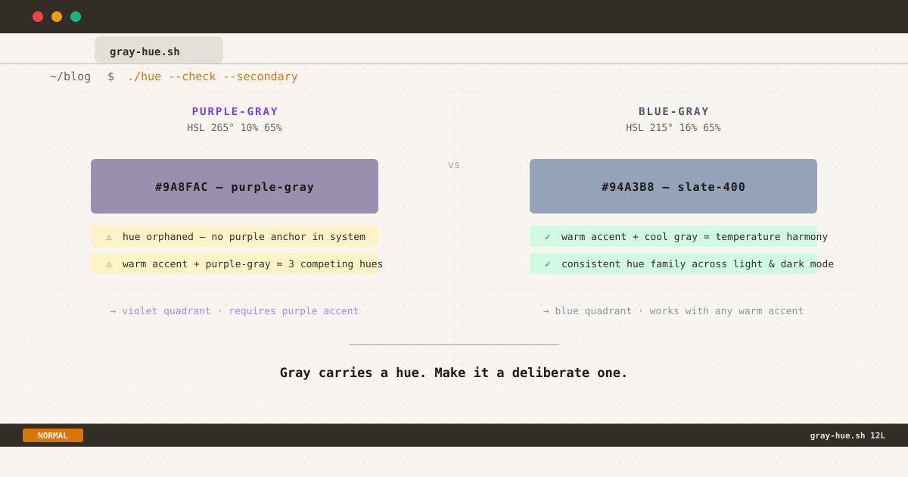

*Purple-gray vs blue-gray: same lightness, different hue — know which you're using*

It started with a feeling. Not a bug report, not a failed contrast check — just a quiet, persistent sense that something in my dark mode was slightly *off*. The contrast ratios passed WCAG AA. The accent color was correct. And yet secondary text felt like it belonged to a different page.

The culprit turned out to be a single HSL value: the hue of my gray.

## Gray Is Never Achromatic on Screen

Print designers work with true neutral grays — CMYK values where equal parts of each channel produce a colorless tone. On screens, gray is different. Every digital gray is an RGB triplet, and unless all three channels are precisely equal, your gray carries a hue.

`#808080` is `HSL(0°, 0%, 50%)` — a genuine neutral. But the moment you pick a gray from a design system, a framework palette, or a "neutral" swatch in Figma, you are almost certainly looking at a tinted gray. The question is not *whether* your gray has a hue. The question is *which* hue, and whether you chose it deliberately.

## The Two Most Common Gray Hues in Web UI

Among tinted grays used for secondary text in web interfaces, two hue families dominate:

### Blue-Gray (HSL ~200°–230°)

The most widely deployed family in professional UI systems. Tailwind's `slate-400` sits at approximately `HSL 215° 16% 65%` — a cool, slightly blue-leaning tone. GitHub's dark mode uses `#8b949e` (close to `HSL 210° 10% 59%`). Linear, Warp, and Raycast — widely cited as exemplary dark mode implementations — all lean toward this blue-gray family for secondary text.

The hue at 215° places these grays in the same color temperature as most display blue channels, which tend to render this range with perceptual crispness across both IPS and AMOLED panels.

### Purple-Gray (HSL ~250°–280°)

Less common as a deliberate choice for text, more common as an accidental one. Purple-gray emerges when a designer picks a gray that trends toward violet — often from a design kit built around purple accent systems, or from a cascade conflict that shifts a neutral token toward the red-blue overlap at high lightness.

Tailwind's `zinc-400` (`#a1a1aa`, `HSL 240° 4% 65%`) sits at the boundary — barely perceptible as purple-tinted. True purple-gray territory begins around `265°–280°`, where the gray visibly cools toward violet.

## What the Research Says

Color theory for screen typography has been studied with increasing rigor as dark mode has become a first-class design concern.

**On hue coherence:** Design systems researchers at EightShapes note that teams frequently revisit their gray palettes specifically to "cool a blander grayscale toward blueish grays or charcoals" as a deliberate professional choice — not as a default.[^eightshapes] The implication is that hue selection in neutrals should be a conscious decision anchored to the broader color system.

**On dark mode text contrast:** Design system practitioners frequently observe that text color is "where the most common mistake lives" in dark mode — and that this extends beyond luminance to hue.[^dark-mode] A gray that reads as professional and quiet on a light background can feel tonally disconnected in dark mode if its hue has no relationship to the surrounding accent or brand color.

**On the WCAG floor:** Gray text brightness on a `#161616` dark background should maintain at least 4.5:1 contrast ratio for body text (WCAG AA), and 3:1 for large text. Both blue-gray and purple-gray at the typical 400–500 range of design scales can meet this threshold — meaning hue choice, in this context, is primarily an aesthetic and coherence decision rather than an accessibility one.

**On OLED behavior:** UXMatters notes that highly saturated blues cause particular rendering challenges on dark backgrounds,[^uxmatters] but at the low saturation levels typical of text grays (4–16%), this is not a significant concern for either family in practice.

## The Hue Coherence Problem

The strongest practical argument for choosing one gray family over another comes down to **hue coherence within your own color system**.

Consider three scenarios:

**Scenario A: Amber accent, blue-gray secondary text**
The warm amber and cool blue-gray create a classic temperature complement. Two hue families, one warm, one cool. The eye reads them as clearly differentiated and harmonious. This is the triad I settled on: amber at `HSL 26° 90% 37%` for accent, and a blue-gray at `HSL 218° 12% 65%` for secondary text in dark mode.

**Scenario B: Amber accent, purple-gray secondary text**
Now you have three competing hue references: near-white primary text (neutral), purple-gray secondary text (violet-leaning), amber accent (warm orange). None of these are strictly wrong, but the purple-gray has no anchor — nothing else in the system is purple. It reads as an uninvited guest.

**Scenario C: Purple accent, purple-gray secondary text**
This works well. The secondary text hue is a desaturated echo of the primary accent. The hue family is consistent. This is likely the design context that originated many purple-gray text choices.

The conclusion is not that blue-gray is superior. It is that **secondary text hue should be a deliberate echo of something else in your system**, rather than an incidental output of a picked gray swatch.

## Light Mode and Dark Mode: The Continuity Issue

One underappreciated consequence of choosing different hue families for light and dark mode secondary text is the perceived discontinuity for users who switch modes.

I wrote about this blog's overall dark mode approach in [a separate post about one palette, two modes](/posts/one-palette-two-modes). The principle there was: maintain the same color tokens across both themes, varying only lightness and saturation — not hue. The gray hierarchy follows the same rule.

My light mode secondary text is `#58606e` (`HSL 218° 11% 39%` — blue-gray). My dark mode secondary text is `#9ba3b1` (`HSL 218° 12% 65%` — same blue-gray family). The hue is within 1° across modes. The semantic meaning of "secondary text" preserves its identity regardless of theme.

If your light mode secondary text is a cool blue-gray and your dark mode secondary text drifts toward purple-gray, the same semantic role now carries a different hue identity in each mode. Users with higher color sensitivity — or those switching frequently — will perceive secondary text as a different *kind* of content, not just a different *brightness* of the same content.

Here is what the actual token structure looks like in production:

```css
:root {
  --text-body: #2d323c;
  --text-secondary: #58606e;   /* HSL 218° 11% 39% — blue-gray */
  --text-tertiary: #7e8695;
}

[data-theme="dark"] {
  --text-body: #b6bac4;
  --text-secondary: #9ba3b1;   /* HSL 218° 12% 65% — same blue-gray */
  --text-tertiary: #6e7685;
}
```

## Detecting Hue Drift in Your Own System

Purple-gray can enter a CSS system through paths that are easy to miss:

**Framework palette mismatch.** Using `gray-*` for light mode and `zinc-*` for dark mode introduces a hue shift at the 400–500 range, where zinc leans purple relative to gray.

**CSS variable cascade conflicts.** A `filter` property, `mix-blend-mode`, or unintended inheritance can shift the computed color of a token without changing the declared value.

**Design tool rendering.** Some design tools render gray swatches with a slight tint that doesn't translate accurately to browser rendering.

**To check your current secondary text hue:**

```css
/* Open DevTools → Elements → Computed → color
 * Look for the HSL representation */

/* Blue-gray safe range: H 200°–230° */
/* Boundary zone:        H 230°–250° */
/* Purple-gray zone:     H 250°–290° */

/* Your tokens should read intentionally, not accidentally */
:root {
  --text-secondary: /* your value */;
}
```

If the hue values differ by more than 20–30° between your light and dark mode, your secondary text is presenting as a different hue family in each mode. This may be intentional — but it is worth naming that decision explicitly.

## A Note on Personal Preference and Context

Blue-gray secondary text is not universally superior. It is the dominant choice in developer tools, technical documentation, and professional SaaS interfaces — contexts where the blue-axis hue feels native and unobtrusive.

Purple-gray secondary text is entirely appropriate in contexts where purple is part of the brand or accent system. Stripe's documentation, Linear's UI, and many creative tool interfaces use purple-adjacent grays with excellent results because their accent system provides the hue anchor.

The Tailwind team ships multiple gray families precisely because no single hue works for every context. Slate, gray, zinc, neutral, and stone each exist to serve different brand temperature preferences.

The real question is never *which* hue is correct for everyone — it is *whether you chose it deliberately for your system*.

## Practical Checklist

Before shipping your dark mode typography tokens:

1. **Check HSL hue of your secondary text** in DevTools Computed panel for both modes.
2. **Verify hue family consistency** — light mode and dark mode secondary text should share the same hue range (200°–230° blue-gray, or 250°–280° purple-gray), differing only in lightness.
3. **Cross-reference with your accent color** — does your text hue family have a coherent relationship with your primary accent? Temperature complement (warm accent + cool gray) or family echo (purple accent + purple-gray) both work. Arbitrary combination does not.
4. **Test on AMOLED hardware** if possible — hue rendering on OLED panels can reveal tints that IPS displays suppress.
5. **Name your decision in a comment** — a one-line CSS comment explaining why you chose your gray hue is worth more than any automated lint rule.

## The One Number That Matters

Your secondary text hue is a number between 0° and 360°. Right now, in your production dark mode, you may not know what that number is. Taking ten seconds to check it in DevTools is the fastest typography audit you will ever run.

Gray carries a hue. Make it a deliberate one.

[^eightshapes]: EightShapes, "Color in Design Systems," 2016 — eightshapes.com/articles/color-in-design-systems
[^dark-mode]: Commonly noted by design system practitioners and researchers; see also Material Design's dark mode guidelines (m3.material.io)
[^uxmatters]: UXmatters, "Dark Isn't Just a Mode," 2020 — uxmatters.com/mt/archives/2020/01/dark-isnt-just-a-mode.php

---

*The HSL values cited in this post are approximate and may vary by tool and color space. CSS variable values shown reflect the actual production tokens used on this blog at the time of writing. This post is part of a series on the [terminal redesign](/posts/redesign-log-terminal-theme) and the [dark mode implementation](/posts/one-palette-two-modes).*
