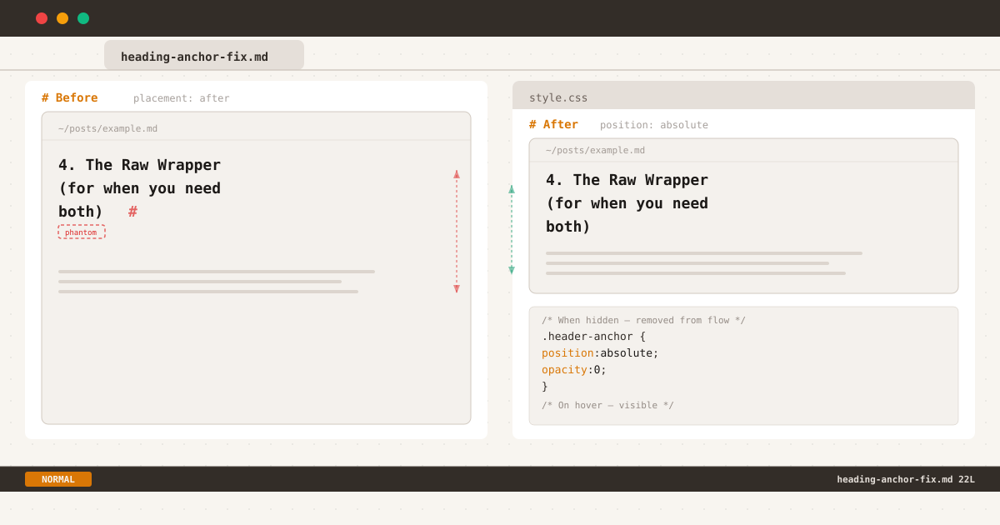

*One CSS property — `position: absolute` — eliminates the phantom spacing by removing the anchor from the layout flow.*

If you use a static site generator with markdown-it-anchor, eleventy-plugin-anchor, or any tool that auto-generates heading permalinks, you've probably seen this HTML pattern:

```html
<h2 id="the-problem">The Problem <a class="header-anchor" href="#the-problem">#</a></h2>
```

A tiny `#` link appended to every heading. Invisible until hovered (`opacity: 0` by default). Harmless, right?

I thought so too. Until I pulled up a post on my phone and noticed something off.

## The Bug

Between a wrapped heading and the paragraph below it, there was an inexplicable gap. Not the heading's `margin-bottom` — extra, uneven space that appeared only on narrow viewports. The kind of gap that makes you zoom in, screenshot, and open Chrome DevTools on your phone.

After some inspection, the culprit was obvious: the `#` anchor link at the end of the heading.

On desktop, headings are short enough to fit on one line. The invisible `#` sits at the end — present but innocuous. On mobile, a long heading wraps. And when the last word's line is a tight fit, the anchor `#` gets pushed to its own line:

```
The Raw Wrapper (for when you
                    need both)
                            #
```

That orphan line is invisible (`opacity: 0`) but still takes up space. The heading's `line-height` applies. Suddenly your heading has a phantom third line — an extra ~24px of blank space separating it from the paragraph below.

The gap wasn't caused by any layout algorithm or CSS bug. It was caused by an element that was styled to be invisible but never told to stop participating in layout.

## First Attempt: Move It

My first instinct was to move the anchor from after the heading to before it. The logic: if the `#` is at the start of the heading, it won't orphan at the end.

```js
// before
permalink: markdownItAnchor.permalink.ariaHidden({
  placement: "after",  // <-- problem
  symbol: "#",
})

// after  
permalink: markdownItAnchor.permalink.ariaHidden({
  placement: "before", // <-- tried this
  symbol: "#",
})
```

The HTML becomes:

```html
<h2 id="the-problem"><a class="header-anchor" href="#the-problem">#</a> The Problem</h2>
```

Problem solved? Visually, the invisible anchor at the start of the heading shouldn't create phantom space at the bottom.

But now every heading on the page looked indented. The invisible `#` (still `opacity: 0`) plus its `margin-right` pushed the heading text ~10px to the right. On mobile, every heading appeared to have a mysterious left indent that no other text had.

I had fixed the vertical spacing only to break horizontal alignment. Worse — the fix was invisible to hover, so anyone who hovered over the heading would see the `#` appear awkwardly before the text.

This approach introduced a new problem without cleanly solving the original one. Back to the drawing board.

## First Attempt: Zero Width

I was convinced the right answer was making the anchor **physically zero-dimensional** — no character width, no line-height contribution, nothing. CSS `font-size: 0` with `line-height: 0` seemed perfect:

```css
.header-anchor {
  opacity: 0;
  font-size: 0;
  line-height: 0;
  ...
}
```

On desktop, it worked. But on mobile, the phantom gap was still there. Not as large, but present. Here's why.

### The Strut Problem

Every line box in CSS starts with a zero-width inline box called the **strut** — it carries the parent element's `font-size` and `line-height`. When the anchor `#` wraps to its own orphan line, the strut is already there with the heading's full line-height.

Even with `font-size: 0` and `line-height: 0`, the line box containing just the anchor still has the heading's line-height. The strut doesn't care about the anchor's font-size — it inherits from the heading. The orphan line might have zero-width content, but it still occupies full vertical space.

The fix was correct in spirit but wrong in mechanism. Making the anchor zero-dimensional still leaves it in the line box, and the strut ensures every line box has the parent's line-height.

## The Fix: Out of Flow

The right answer isn't about shrinking the anchor — it's about **removing it from the layout flow entirely** while keeping it in the DOM.

The key insight: if the anchor is `position: absolute`, it no longer participates in the line box calculation. The strut only sees the heading text. No orphan line, no phantom gap.

Here's the final implementation:

```css
h1, h2, h3, h4, h5, h6 {
  position: relative;
}

.header-anchor {
  position: absolute;
  color: var(--text-tertiary);
  text-decoration: none;
  margin-left: 0.25rem;
  opacity: 0;
  transition: opacity 0.15s ease;
}

:hover > .header-anchor,
.header-anchor:focus {
  opacity: 1;
  transition: opacity 0.15s ease;
}
```

Let's break down what each part does:

**`position: relative` on headings** — Establishes a positioning context so the anchor's `absolute` position is relative to the heading, not the viewport or a higher ancestor.

**`position: absolute` on anchor** — Removes the anchor from the inline flow. The heading's line box no longer sees it. Even if the `#` wraps to the end of a long heading, it exists outside the line box calculation. The strut only interacts with the heading text.

**`margin-left: 0.25rem`** — Adds a small gap between the heading text and the anchor when visible. Since the anchor is `position: absolute`, this margin shifts it right relative to its static position (the end of the text). The heading text itself is unaffected.

**`opacity: 0` → `opacity: 1` on hover/focus** — Simple fade transition. No font-size or line-height gymnastics needed. The anchor is always at its natural size; it just fades in and out.

### Why This Works

When the heading wraps on a narrow viewport, the text breaks across multiple lines naturally. The anchor is `position: absolute`, so it doesn't create its own line box. The strut on each line only sees the heading text — no orphan line, no phantom space.

On desktop where the heading fits on one line, the anchor sits at the end of the text. `margin-left: 0.25rem` shifts it 4px to the right. On hover, it fades in. On unhover, it fades out. No reflow, no flicker.

## Why Not Alternatives?

Here's how other approaches stack up:

**`font-size: 0` + `line-height: 0`** — My first attempt. Makes the anchor zero-dimensional but doesn't remove it from the line box. The CSS strut (inheriting the heading's line-height) still creates a full-height orphan line when the anchor wraps. The gap is smaller but not eliminated.

**`display: none`** — Removes the element from layout entirely. Works, but `display` can't be animated with CSS transitions, so hovering feels abrupt. The element also can't receive focus when hidden, which hurts keyboard navigation.

**`visibility: hidden`** — Makes the element invisible but keeps it in the flow. Same strut problem as `opacity: 0` — no layout benefit.

**`width: 0; overflow: hidden`** — Requires `display: inline-block`, which changes how the element interacts with surrounding inline content. The `overflow: hidden` prevents the anchor from being revealed on hover.

`position: absolute` is the right tradeoff. It removes the anchor from the line box — solving the root cause — while keeping it in the DOM for hover, focus, and smooth opacity transitions.

## What This Taught Me

The `#` anchor link is a tiny element — one character, invisible by default, easy to overlook. But fixing its layout impact forced me through three iterations:

1. **Move the anchor before the heading text** — broke horizontal alignment
2. **Shrink the anchor to zero size** — the CSS strut still created orphan lines
3. **Remove the anchor from flow** — finally eliminated the phantom space

The lesson isn't about any single CSS property. It's about understanding how the **strut** interacts with line boxes. An invisible element can still affect layout through mechanisms that `opacity` and `font-size` don't control. The only way to stop an inline element from affecting its line box is to stop it from being in the line box — and `position: absolute` is the cleanest way to do that.

This isn't the first time a deceptively simple CSS pattern needed multiple iterations to get right. The same thing happened while [building the dot leader pattern](/posts/dot-leader-pattern/): three edge cases, zero margin changes, and a `line-height: 1` fix to prevent exactly this kind of phantom vertical space.

Not every layout bug needs a complex solution. Sometimes the right fix is asking: "if this element shouldn't affect layout, why is it still in the layout?"

*This blog runs on Eleventy with markdown-it-anchor. The full source — including the final fix above — is on [GitHub](https://github.com/tionosulis/tionosulis.github.io).*
