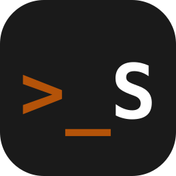

Welcome to the new iteration of my little corner on the web. This is a placeholder post that also serves as a typography test suite. Below you'll find every common Markdown element to make sure everything renders nicely.

${toc}

## Paragraphs

Lorem ipsum dolor sit amet, consectetur adipiscing elit. Sed do eiusmod tempor incididunt ut labore et dolore magna aliqua. Ut enim ad minim veniam, quis nostrud exercitation ullamco laboris nisi ut aliquip ex ea commodo consequat.

Duis aute irure dolor in reprehenderit in voluptate velit esse cillum dolore eu fugiat nulla pariatur. Excepteur sint occaecat cupidatat non proident, sunt in culpa qui officia deserunt mollit anim id est laborum.

## Inline Formatting

This text has **bold**, _italic_, ~~strikethrough~~, and **_bold italic_**. Here's some `inline code` and a [hyperlink](https://www.11ty.dev/). You can also have <mark>highlighted text</mark> and <kbd>keyboard input</kbd>.

## Blockquotes

> This is a simple blockquote. It should stand out from the surrounding text while remaining readable.

> This is a longer blockquote with multiple paragraphs. Lorem ipsum dolor sit amet, consectetur adipiscing elit. Sed do eiusmod tempor incididunt ut labore et dolore magna aliqua.
>
> Ut enim ad minim veniam, quis nostrud exercitation ullamco laboris nisi ut aliquip ex ea commodo consequat.
>
> > And this is a nested blockquote for good measure.
>
> <cite>Someone Famous</cite>

## Lists

### Unordered

- Item one
- Item two
  - Nested item A
  - Nested item B
- Item three
- Item four

### Ordered

1. First item
2. Second item
3. Third item
   1. Nested 3.1
   2. Nested 3.2
4. Fourth item

### Mixed

- Level 1
  1. Level 2 ordered
  2. Level 2 ordered
     - Level 3 unordered
- Back to level 1

## Code Blocks

### JavaScript

```javascript
function fibonacci(n) {
  if (n <= 1) return n;
  return fibonacci(n - 1) + fibonacci(n - 2);
}

const result = fibonacci(10);
console.log(`The 10th Fibonacci number is ${result}`);
```

### HTML

```html
<!doctype html>
<html lang="en">
<head>
  <meta charset="utf-8">
  <meta name="viewport" content="width=device-width, initial-scale=1.0">
  <title>Example</title>
</head>
<body>
  <h1>Hello World</h1>
  <p>This is an example HTML document.</p>
</body>
</html>
```

### CSS with nesting

```css
.card {
  background: var(--bg);
  border-radius: 8px;
  padding: 1.5rem;

  & .title {
    font-size: 1.25rem;
    font-weight: 600;
  }

  & .body {
    color: var(--text-secondary);
    line-height: 1.6;
  }
}
```

### Diff

```diff
-function oldName() {
+function newName() {
   return 42;
 }
```

## Horizontal Rule

---

## Tables

| Feature | Status | Priority |
|---------|--------|----------|
| Dark Mode | Done | High |
| RSS Feed | Done | Medium |
| Search | TBD | Low |
| Comments | TBD | Low |

## Headings (for TOC testing)

### Third Level Heading

Content under H3.

#### Fourth Level Heading

Content under H4. Links in the TOC should work correctly.

##### Fifth Level Heading

Can you even read this?

###### Sixth Level Heading

Tiny but mighty.

## Images



## Conclusion

That's it for the typography test suite. If everything looks right, the site is ready for real content. See you around!
