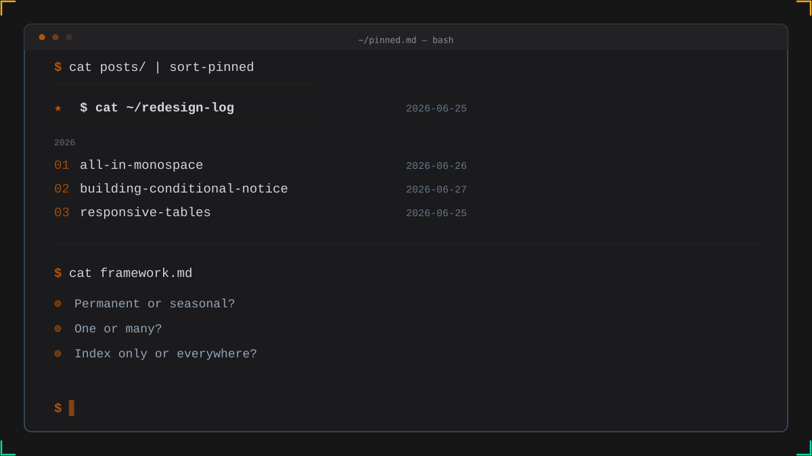

*Terminal post listing: pinned ★ above year label, chronological entries with numbered counters below.*

Every blog has one post that matters more than the rest. A getting-started guide. A design manifesto. A "what is this blog about" that reads like a mission statement.

Chronology says: put it at position four, after three newer posts. The reader scrolls past it to reach the latest entry. They might not know it exists.

Pinned posts solve this — a single item that stays at the top of your post list regardless of publication date. The concept is simple. The execution is where most people overthink it.

## Before You Pin: A Framework

A pinned post breaks one of the core contracts of a blog: chronological order. Before you break that contract, ask three questions.

### 1. Permanent or Seasonal?

A post pinned for the wrong reason is worse than no pinned post. It creates confusion when readers expect new content at the top.

**Permanent pins** — An about page, a changelog, a manifesto. Content that stays relevant indefinitely. These are the strongest candidates.

**Seasonal pins** — A call for submissions, a conference announcement, a temporary notice. These should always have an expiration plan. If you pin seasonally, schedule a calendar reminder to unpin it.

**The test:** If the pinned post is still relevant six months from now, pin it. If not, find another way to surface it.

### 2. One or Many?

Multiple pinned posts defeat the purpose. A single pin creates focus. Two pins split attention. Three pins just look like a broken sort order.

The rule: one pinned post, maximum. If you have more than one post that needs prominence, consider a dedicated "featured" section below the pinned item — not a second pin.

### 3. Index Only or Everywhere?

A pinned post on the main index makes sense. Should it also float to the top of tag pages? RSS feeds? Archive views?

There is no universal answer, but there is a consistent principle: **pinned is a visual site concept, not a content priority signal.** Applying it to RSS feeds breaks the expectations of feed readers (which are inherently chronological). Applying it to tag pages is debatable — some readers browse tags specifically for chronological exploration.

My default: **pin on the main index only.** Let tag pages and feeds stay naturally sorted.

## The Design Constraints

Once you've decided to pin, the implementation must satisfy three constraints:

1. **Visual distinction** — The pinned post should not look like "post number one in a sorted list." It needs a signal that says "this one is special."
2. **Count integrity** — The pinned post counts toward the total post count. It isn't excluded, duplicated, or hidden.
3. **Chronological clarity** — The rest of the list should still look and feel chronological. The year labels, the date stamps, the reverse-chronological flow — all preserved for the unpinned posts.

These constraints rule out the simplest implementation (hardcoding a post at the top of your template). That approach breaks count integrity and skips the visual distinction problem. A proper solution needs all three.

## The Implementation

Here is how I applied this framework to this blog. The specific stack is Eleventy, but the pattern translates to any SSG.

### Step 1: The Frontmatter Flag

A boolean field in the post's frontmatter:

```yaml
pinned: true
```

No separate configuration file. No hardcoded list of post slugs. The data lives with the post, where it belongs.

### Step 2: A Sort Filter

The filter takes the full post collection and returns pinned items first, then everything else in reverse-chronological order:

```js
eleventyConfig.addFilter("sortPinned", (collection) => {
  const pinned = collection.filter(p => p.data.pinned);
  const rest = collection.filter(p => !p.data.pinned).reverse();
  return [...pinned, ...rest];
});
```

This is the entire logic. Two arrays, one spread. It replaces the standard `| reverse` in your post list template.

### Step 3: The Template Adjustments

Three changes in the loop that renders your post list:


```diff
- 
+ 

- 
+ 
```


The first line swaps the sort order. The second line prevents a year label from rendering above the pinned post — it sits outside the chronological grouping, as it should.

And a class for styling:


```diff
- <li class="post-item">
+ <li class="post-item pinned">
```


### Step 4: The Visual Treatment

The pinned post gets a `★` in place of its numbered counter:

```css
.post-item.pinned {
  counter-increment: none;
}
.post-item.pinned::before {
  content: "★";
  color: var(--accent);
  font-size: 0.85rem;
}
```

The `★` is amber (accent color), larger than the standard counter, and the post itself skips counter increment so the numbering stays continuous for the rest of the list.

### The Result

```
 ★ │ $ cat ~/redesign-log        2026-06-25   ← pinned, outside year-group
 01 │ all-in-monospace            2026-06-26
 02 │ building-conditional-notice 2026-06-27
 03 │ responsive-tables           ...
```

The pinned post sits above the year label. The counter starts at `01` for the unpinned posts. The date stamps remain visible. The count in the header (`"12 entries"`) includes the pinned post because it reads from the original collection, not the sorted copy.

## What Not to Do

Two anti-patterns I see often:

**Hardcoding.** Manually inserting a post at the top of a template. It works once, breaks when you unpin, and your post count is now wrong.

**Duplicating in frontmatter.** Some implementations add `pinned: true` and also require the post slug in a separate configuration array. Redundant data is a maintenance trap.

A single frontmatter flag handles both the decision and the display. Everything else follows from it.

## The Takeaway

Pinned posts are a compromise between two legitimate needs: chronology tells readers what's new; prominence tells readers what's important. A good implementation minimizes the compromise.

A framework helps you decide if the compromise is worth it. A frontmatter flag and 15 lines of code help you execute it cleanly. A `★` helps your readers see it at a glance.

[The redesign log](/posts/redesign-log-terminal-theme) was the first post I pinned — a field log of transforming this blog into a terminal-themed space. It was not the newest post, but for a first-time visitor, it was the most important one. That is exactly the kind of case this framework was made for.

*Complementary reading: [DIY Draft System for Eleventy v3](/posts/diy-draft-system-eleventy) — another way to extend your Eleventy blog beyond default behavior.*
