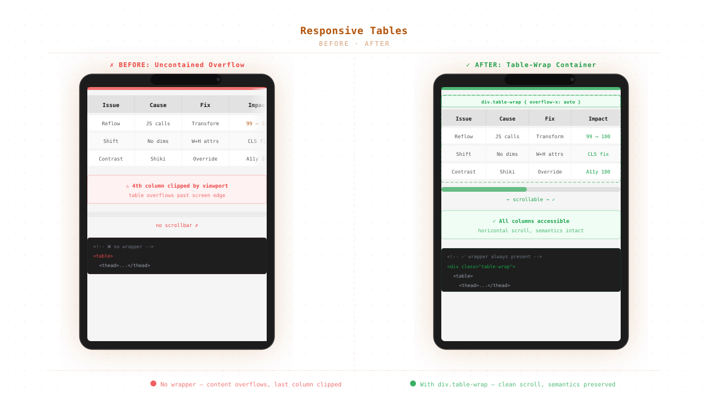

*The fix: a wrapper div with horizontal scroll, preserving table semantics*


## The Problem

I published a blog post with a four-column comparison table. On desktop, it rendered beautifully — columns evenly spaced, data scannable at a glance. On mobile, the last column (Impact) drifted quietly off-screen. No scrollbar. No wrap. No warning. Just invisible data.

This is the fundamental nature of HTML tables: their minimum width is determined by the sum of their cell content. A cell containing "Performance 99 → 100" needs more horizontal space than a 375px viewport can give it. The browser respects the content — and the content breaks the layout.

## The Solutions Landscape

There are several approaches to making tables responsive. Most of them have a hidden cost.

### ❌ `display: block` on the Table

```css
table { display: block; overflow-x: auto; }
```

This creates a scrollable container, but it **destroys table semantics**. When a screen reader encounters a `<table>` with `display: block`, it no longer recognizes it as tabular data. The relationship between headers and cells — the very reason tables exist in HTML — is lost. [^1]

### ❌ Stack Layout (Card-Style)

Some frameworks convert each table row into a stacked card on mobile. Each cell becomes a labeled block:

```css
@media (max-width: 600px) {
  thead { display: none; }
  td::before { content: attr(data-label); }
}
```

This works for simple data sets but fails when:
- Users need to compare values across rows
- The table contains numeric data meant for scanning
- Screen reader users rely on consistent column navigation

### ❌ JavaScript Plugins

Plugins like TablePress or custom jQuery solutions add weight, dependencies, and maintenance overhead. For a blog with three to four small tables, a plugin is a missile launcher aimed at a housefly.

### ✅ The Wrapper Pattern

The cleanest approach is also the simplest:

```html
<div class="table-wrap">
  <table>
    <!-- your table -->
  </table>
</div>
```

```css
.table-wrap {
  overflow-x: auto;
  -webkit-overflow-scrolling: touch;
  max-width: 100%;
}
```

The `<table>` keeps its native semantics. Screen readers see a table. The browser sees a table. The _layout_ sees a scrollable container that only activates when the table exceeds the viewport width.

## Why This Works Semantically

The key insight is that **overflow is a visual concern, not a structural one**. Adding a wrapper div does not change the document outline. It does not alter the accessibility tree's understanding of the table. It is a pure layout intervention.

Compare:

| Approach | Screen reader | Visual result | Runtime cost |
|---|---|---|---|
| `display: block` on table | ❌ Loses semantics | Scrollable | Zero |
| Stack layout | ⚠️ Loses column nav | Card-like | Zero |
| JS plugin | ✅ Depends on impl | Varies | ~5-50KB |
| **Wrapper div** | ✅ Preserved | Scrollable | Zero |

## Implementation (Generic Pattern)

The wrapper pattern is best applied during build time, not at runtime. Every static site generator has a mechanism for transforming HTML output:

- **Eleventy, Hugo, Astro, Next.js:** Use a build-time transform or render function
- **WordPress, PHP:** Modify the template or use an output buffer
- **Hand-rolled HTML:** Hardcode the wrapper (lowest effort, works everywhere)

The transform pattern looks like this (SSG-agnostic pseudocode):

```javascript
// Build-time transform: wrap every <table> in a <div class="table-wrap">
content = content.replace(/<table/g, '<div class="table-wrap"><table>')
                 .replace(/<\/table>/g, '</table></div>');
```

This runs once during the build. At runtime, there is zero JavaScript, zero layout recalculations, zero overhead.

## Accessibility Considerations

A scrollable region on mobile must be discoverable. Users need to know there's more content off-screen. The browser's native `overflow: auto` provides a scrollbar on most platforms, but there are two things to verify:

1. **The scrollbar is visible.** Some UI frameworks hide scrollbars by default (`::-webkit-scrollbar { display: none }`). Resist this — your mobile users need to see it.

2. **Keyboard navigation works.** Users tab to the table, then use arrow keys to scroll horizontally if the table is focusable. If you want the scrollable region to receive keyboard focus, add `tabindex="0"` to the wrapper. [^2]

## Caveat: When the Wrapper Isn't Enough

For tables with more than six to seven columns, even horizontal scrolling becomes cumbersome. At that point, consider:

- **Reconsidering the data layout.** Does this really need to be a single flat table?
- **Using a column picker** (optional columns shown/hidden by the user)
- **Splitting the table** into multiple smaller tables

But for the typical blog table — three to six columns of comparison data — the wrapper pattern is all you need.

## The Takeaway

Three lines of CSS and one build-time transform. No framework dependency. No runtime JavaScript. No semantic compromise. The table stays a table, the layout stays responsive, and your mobile readers get to see all four columns.

The fix is trivial. The principle behind it — separating presentation from semantics — is timeless.

[^1]: The HTML spec explicitly states that `display: block` on a `<table>` removes its table semantics in the accessibility tree. See the [HTML Accessibility API Mappings](https://w3c.github.io/html-aam/).

[^2]: WCAG 2.1 Success Criterion 2.1.1 (Keyboard) requires all functionality to be operable through a keyboard interface. A focusable scroll container satisfies this for horizontal overflow regions.
