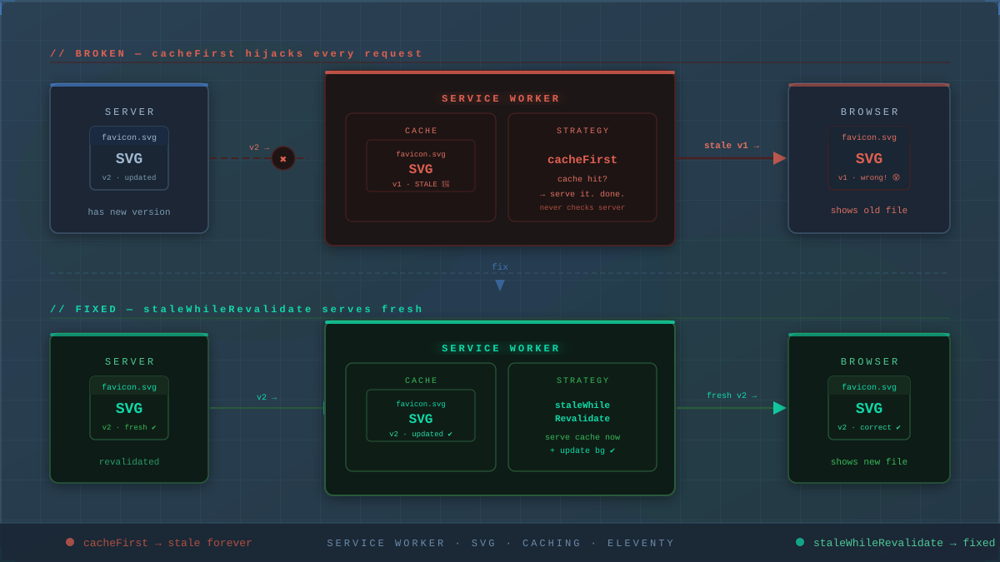
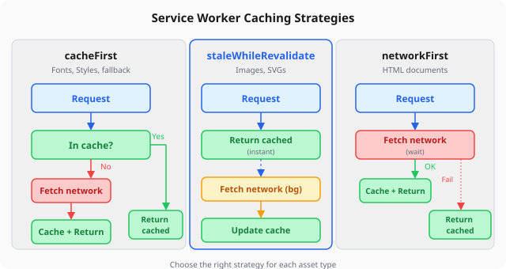

*The same SVG, two different caching strategies: `cacheFirst` returns a stale version from cache (v1), while `staleWhileRevalidate` checks the network first and serves the latest version (v2).*

${toc}

## The Setup

Earlier this week, I published a post about applying the golden ratio to this blog's design. Part of the post included a before-and-after SVG diagram showing the "S" monogram and theme toggle with their new proportional relationship.

I wrote the SVG, added it to the post, built the site, and pushed to GitHub Pages. Standard workflow. I'd done this before — the previous posts had SVGs that rendered perfectly.

## The Mystery

The SVG file itself was fine. I could open it directly in a browser tab and see the diagram. The file was being served with the correct MIME type (`image/svg+xml`). The HTML page had the right `` tag pointing to the right URL.

But on the actual blog post page — nothing. A blank space where the diagram should be.

## The Debugging Spiral

Here's where things got frustrating. I assumed the problem was in the SVG markup. SVG can be finicky, so I went through four rounds of fixes:

**Round 1:** HTML entities. SVGs use strict XML parsing, so `&times;` and `&rarr;` can fail. I replaced them with numeric character references.

**Round 2:** CSS selectors. The dark mode overrides used `nth-child` selectors that were off by one because I'd removed a text element. Fixed the indices.

**Round 3:** CSS class-based styling. I moved all colors and fonts from inline attributes to CSS classes inside `<defs>`. Some browsers don't apply `<defs>`-scoped CSS reliably when an SVG is loaded via ``.

**Round 4:** Removed the `<style>` block entirely. Stripped down to bare inline attributes, plain ASCII text, zero entities. The simplest possible SVG.

Every fix was valid XML. Every version rendered correctly when opened directly. None of them appeared on the live blog page.

## The Real Culprit

After the fourth attempt, I stepped back and asked a different question: *What if the problem isn't the SVG at all?*

The blog has a service worker — a Progressive Web App feature that intercepts network requests and serves cached responses. It's great for offline support and speed. But it has a subtle trap.

Here's the fetch handler logic from the service worker:

```javascript
if (request.destination === "font" || request.destination === "style") {
  event.respondWith(cacheFirst(request));
} else if (request.destination === "document") {
  event.respondWith(networkFirst(request));
} else {
  event.respondWith(cacheFirst(request));
}
```

The `else` block covers everything else — including images. SVGs loaded via `` have `request.destination = "image"`, so they get the `cacheFirst` strategy.

This means: the first time the browser loads the SVG, the service worker fetches it from the server and stores it in the cache. Every subsequent visit — including every page refresh — the service worker serves the cached version. **It never checks the server for updates.**

I'd pushed five different versions of the SVG, but the browser only ever saw the first one. Every "fix" I made was invisible because the service worker was happily serving the original broken file from its cache.

## The Fix

Two changes solved the problem:

**1. Bump the cache version.**

```javascript
// Before
const CACHE = "v1";

// After
const CACHE = "v2";
```

The service worker's `activate` event deletes any cache that doesn't match the current version. Bumping to `v2` forced the browser to discard all cached assets and start fresh.

**2. Change the caching strategy for images.**

```javascript
// Before: cache first, never update
else {
  event.respondWith(cacheFirst(request));
}

// After: stale-while-revalidate for images
else if (request.destination === "image") {
  event.respondWith(staleWhileRevalidate(request));
} else {
  event.respondWith(cacheFirst(request));
}
```

`cacheFirst` is fine for fonts and stylesheets — they rarely change and are usually versioned by filename. But images need `staleWhileRevalidate`: serve the cached version immediately (no loading delay), but fetch the latest version from the network in the background. Next time the user visits, the new version is ready.

This is the function that makes it work:

```javascript
async function staleWhileRevalidate(request) {
  const cached = await caches.match(request);
  const fetchPromise = fetchAndCache(request);
  return cached || fetchPromise;
}
```



## What I Learned

The debugging process exposed three things I should have checked from the start:

| Assumption | Reality |
|---|---|
| If the file is valid, the browser will render it | Not if the service worker intercepts the request |
| Refreshing the page fetches fresh content | Not with `cacheFirst` — the SW serves from cache |
| If I can see the file at its URL, everyone can | The SW cache can override what the server sends |

The most frustrating part is how obvious it seems in hindsight. Every developer who's worked with service workers has a similar story — a "stale cache" ghost that makes you question your markup, your config, and your sanity.

## Why This Matters Beyond This Blog

If you're building a PWA, a mobile app with offline support, or any site that uses a service worker, the caching strategy for each resource type is a design decision, not an implementation detail:

| Strategy | Best for | Why |
|---|---|---|
| `cacheFirst` | Fonts, versioned CSS/JS | Rarely change, size saved is meaningful |
| `networkFirst` | HTML pages | Users expect fresh content |
| `staleWhileRevalidate` | Images, SVGs | Speed + eventual consistency |
| `networkOnly` | API calls, form submissions | Need real-time data |

Choose wrong, and you get either a slow experience (requesting everything from network) or stale assets that don't update (what happened here).

The golden ratio post is now live with its SVG diagram intact. And the service worker is configured a little more wisely than it was yesterday.

---

**Since this post was published.** The service worker has been refined: the install handler uses `Promise.allSettled` so one failed URL doesn't abort the entire precache, `self.skipWaiting()` and `self.clients.claim()` enable immediate activation, and the registration script catches errors gracefully. The three caching strategies at the heart of this story — `cacheFirst` for fonts and styles, `networkFirst` for documents, `staleWhileRevalidate` for images — are unchanged. The current source is [on GitHub](https://github.com/tionosulis/tionosulis.github.io/blob/main/content/sw.njk).

---

*The full source of this blog — including the service worker, all SVGs, and every debugging commit — is [on GitHub](https://github.com/tionosulis/tionosulis.github.io).*
