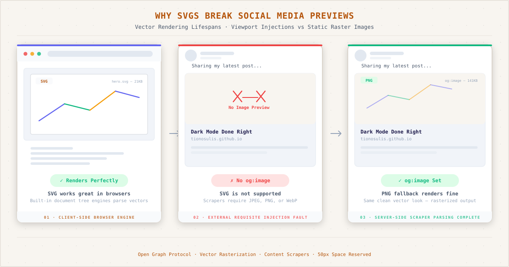
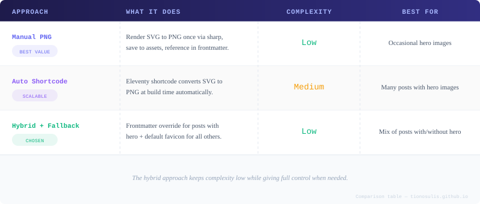

*The three-panel story of an invisible hero image: browser renders SVG beautifully, social media sees nothing, and the PNG fix restores previews.*

I spent hours crafting an SVG infographic for my [dark mode post](/posts/dark-mode-done-right/). Three pillars, indigo-emerald-amber palette, subtle grid dots, code blocks, the works. It looked gorgeous in the browser — crisp at any zoom, 21KB, perfect.

Then I shared the link on Twitter. The preview was blank. Just a URL floating in the void. No image, no card, nothing.

I checked Facebook. Same story. Discord? Empty. Every platform I tested showed the same thing: my beautiful SVG hero image was invisible.

Here's what I learned, what I fixed, and the system I built so it never happens again.

## Why SVGs Don't Work for Social Media Previews

The core issue is simple: social media platforms don't render SVGs. When Twitter, Facebook, or Discord crawl your page looking for an `og:image`, they expect a raster format — JPEG, PNG, or WebP. An SVG in your `` tag is ignored entirely.

SVGs are vector graphics. They can contain scripts, external references, and complex rendering instructions that social media crawlers aren't equipped to handle. Even the most straightforward SVG — no scripts, no external fonts, self-contained — gets skipped. The crawlers see the format and move on.

But there's another layer to this problem. Even if your SVG were somehow processable, you also need the `og:image` meta tag to point at it. If you don't have `og:image` at all, the problem is worse — the crawler has nothing to work with and gives up entirely.

That was my situation: an `og:image` tag that simply didn't exist, and an SVG that wouldn't have worked even if it did.

## The Approaches I Considered

Before settling on a solution, I mapped out three approaches. Each has its tradeoffs.



*The three approaches evaluated: manual rendering, automatic build-time conversion, and the hybrid frontmatter system I ultimately chose.*

### 1. Manual PNG Render

The simplest approach: render the SVG to PNG once with sharp, save it to `assets/img/og/`, and reference the PNG path in the post's frontmatter. No build-time overhead, no plugin configuration, no complexity.

The tradeoff is that it's a manual step. Every new post with a hero image requires a render command — one line in the terminal, but still a step you have to remember.

### 2. Auto Shortcode

The most scalable approach: register an Eleventy shortcode that detects SVG inputs, renders them to PNG at build time, and outputs the correct `` tag with both formats. This is the kind of solution that feels clean and future-proof.

But it's also the most complex. It requires custom code in `eleventy.config.js`, error handling for SVGs with external references, and testing across different SVG features. I've learned the hard way that build-time complexity compounds over time.

### 3. Hybrid + Fallback (The Chosen Approach)

The pragmatic approach: use a frontmatter `image:` field for posts that need a specific hero image, and a global fallback (my favicon PNG) for everything else. Simple, no build-time code, full control per-post.

This is what I went with. Here's how it works.

## The Implementation

The entire system consists of three changes: one config file, one template file, and one frontmatter field.

### Step 1: Render the SVG to PNG

I render the SVG to a 1200&#215;630 PNG using sharp — the same library Eleventy uses under the hood for image processing.

```bash
node -e "require('sharp')('assets/img/dark-mode-done-right.svg').resize(1200,630).png().toFile('assets/img/og/dark-mode-done-right.png')"
```

1200&#215;630 is the standard Open Graph image ratio (1.91:1). This is what every social platform expects for a large card preview.

The output is a 141KB PNG file. Compare that to the 21KB SVG source — the rasterized version is about 7x larger, but still tiny by image standards. And for a hero image that only appears in social media previews, the file size is irrelevant.

### Step 2: Add a Default `og:image` to Site Metadata

I added an `image` field to my site's metadata file:

```js
// _data/metadata.js
export default {
  title: "Sulistiono",
  url: "https://tionosulis.github.io",
  language: "en",
  description: "Sulistiono's thoughts",
  image: "/assets/img/favicon/android-chrome-192x192.png", // default fallback
  author: {
    name: "Sulistiono",
    // ...
  },
};
```

This gives every page on the site a default Open Graph image — in this case, my monogram favicon. It's not a hero image, but it's better than a blank card.

### Step 3: Wire Up the `og:image` Meta Tag

The template is where the magic happens. In `base.njk`, I added this block in the `<head>`:


```html

<meta property="og:image" content="{{ metadata.url }}{{ ogImage }}">
<meta name="twitter:card" content="summary_large_imagesummary">
```


The logic is simple:

1. If the page's frontmatter has an `image` field, use that
2. Otherwise, fall back to the site default from `metadata.js`
3. If the page has a custom image, use the `summary_large_image` Twitter card (large preview). Otherwise, use `summary` (small icon preview)

This single Nunjucks `set` statement handles every case across the entire site.

### Step 4: Set Per-Post Frontmatter

For posts with a dedicated hero image, I add the `image` field to the frontmatter:

```yaml
---
title: "Dark Mode Done Right"
date: 2026-06-13
image: /assets/img/og/dark-mode-done-right.png
tags:
  - css
  - javascript
---
```

That's it. The template picks it up, generates the correct `og:image` URL, and social media crawlers find a proper PNG to display.

## The Result

Here's what changed before and after:

| Before | After |
|---|---|
| No `og:image` meta tag | `og:image` points to PNG |
| Twitter card: `summary` (small icon) | `summary_large_image` for posts with hero |
| SVG ignored by crawlers | PNG 1200&#215;630 renders everywhere |
| Blank previews on social media | Full card with hero image |
| Fallback: nothing | Fallback: favicon monogram |

If I debug the OG tags today, this is what the crawler sees:

```html
<meta property="og:title" content="Dark Mode Done Right: Zero Flicker, CSS Architecture, and the Devil in the Details">
<meta property="og:description" content="How I built a zero-flicker dark mode...">
<meta property="og:image" content="https://tionosulis.github.io/assets/img/og/dark-mode-done-right.png">
<meta name="twitter:card" content="summary_large_image">
```

Every social platform that reads these tags will show a rich preview with the hero image, the title, and the description.

## The Workflow Going Forward

My workflow for any new post is now straightforward:

1. Create the SVG hero image
2. Render a PNG version: `sharp('input.svg').resize(1200,630).png().toFile('assets/img/og/output.png')`
3. Add `image: /assets/img/og/output.png` to the post's frontmatter

Two terminal commands and one YAML line. The default fallback handles everything else.

For posts without a hero image, I do nothing. The favicon kicks in automatically. No blank previews, ever.

## Why I Chose Simple Over Scalable

The auto-shortcode approach is tempting. It feels like the "right" engineering decision — automate everything, eliminate manual steps, build it once and forget it.

But here's the thing: this blog doesn't have dozens of posts with hero images. It has one, and might have ten in a year. Building an automatic SVG-to-PNG pipeline for that volume is overengineering. The manual render approach costs me 30 seconds per post. The shortcode approach would cost me hours to build, test, and maintain.

The hybrid fallback system respects that reality. It's not the most elegant solution on paper. But in practice, it works perfectly, costs almost nothing, and never surprises me.

That's the kind of engineering I value most: the kind that solves today's problem without creating tomorrow's.

*This post is part of a series about building this blog. You can find the full implementation in `eleventy.config.js`, `_includes/layouts/base.njk`, and `_data/metadata.js` on [GitHub](https://github.com/tionosulis/tionosulis.github.io).*
