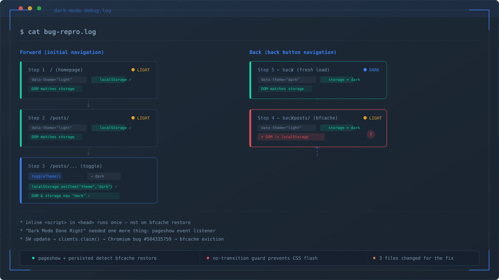

*Forward path (green) shows consistent theme; back-navigation (red) shows the stale-state bug.*

I spent an hour debugging a problem I was told could not exist.

And to be fair — the code looked bulletproof on paper. A synchronous inline `<script>` in `<head>` reads `localStorage` and sets `data-theme` before any CSS paints. A `toggleTheme()` function inverts the attribute and persists to `localStorage`. CSS custom properties cascade the change across every element. It's the architecture I documented in [Dark Mode Done Right](/posts/dark-mode-done-right/), and it's been running without issues since June.

Then a reader sent me a video. Or rather, the reader was me, using my own site on my own phone.

The bug was simple to reproduce but impossible to explain with my mental model of how the theme system worked. This is the story of what I found when I stopped assuming my code was correct and started interrogating the browser itself.

---

## The Bug

Open the homepage. It's in light mode — my default afternoon reading state. Tap the link to the posts list. Still light. Tap any post. Still light. Read for a minute, then toggle to dark mode. The page switches cleanly — 0.2 second CSS transition, smooth, no flicker.

Now press the back button.

The posts list appears — in light mode.

The page I was just on is dark. The system preference hasn't changed. The `localStorage` value is `"dark"`. But the posts list shows light mode, as if the toggle never happened.

Press back again. The homepage appears — this time in dark mode.

Same localStorage, same data-theme attribute in the `<head>` script, same toggle function. But two pages from the same back-stack show different themes.

This is the state diagram:

| Navigation | Page | Expected Theme | Actual Theme | Correct? |
|---|---|---|---|---|
| Forward | Homepage | light | light | ✓ |
| Forward | /posts/ | light | light | ✓ |
| Forward | /posts/heading-anchor-fix/ | light → dark (toggle) | light → dark | ✓ |
| ← Back | /posts/ | dark (as set by user) | **light** | ✗ |
| ← Back | / | dark | dark | ✓ |

The posts page remembers the theme from the initial visit, ignoring the toggle that happened two navigations later. The homepage does the opposite — it correctly picks up the new theme.

Two pages. Same browser. Same session. Different behavior.

---

## The Inline Script's Blind Spot

The zero-flicker trick from [Dark Mode Done Right](/posts/dark-mode-done-right/#the-zero-flicker-trick) is an inline script in `<head>`:

```html
<script>
  var t = localStorage.getItem("theme");
  if (!t) {
    t = window.matchMedia("(prefers-color-scheme:dark)").matches
      ? "dark" : "light";
  }
  document.documentElement.setAttribute("data-theme", t);
</script>
```

This runs synchronously during HTML parsing — before the browser paints anything. The `data-theme` attribute is set before any CSS rule evaluates. That's how zero-flicker works on initial load.

But this script only runs once: during the initial page load.

When you navigate back, the browser may restore the page from **bfcache** (Back-Forward Cache). bfcache is an in-memory snapshot of the entire page — DOM tree, JavaScript heap, CSS state, paused timers, everything. When restored, the page is thawed exactly as it was frozen. The inline `<script>` does not re-execute. The `DOMContentLoaded` and `load` events do not fire.

The `data-theme` attribute in the snapshot reflects the value from the initial visit — `"light"`. The `localStorage`, which lives outside the JavaScript heap, now holds `"dark"`. The DOM attribute and the persistent storage are out of sync.

That section in Dark Mode Done Right that says *"No runtime dependency after page load"* was wrong. There is a runtime dependency — it just only matters when the page comes back from the dead.

---

## What Is bfcache, Exactly?

bfcache stores a frozen page snapshot when the user navigates away. On back or forward navigation, the browser thaws this snapshot in under 10ms — compared to hundreds of milliseconds for a full page reload.

bfcache eligibility is strict. A page is disqualified if it has:

- An `unload` event listener (Chrome and Firefox block this)
- `Cache-Control: no-store` on the response headers
- Open `BroadcastChannel` with registered listeners
- Open `IndexedDB` connections with pending transactions
- `SharedWorker` usage
- An in-progress `fetch()` at the moment of navigation

It is NOT blocked by:

- Service worker `fetch` event handlers
- `localStorage` usage
- CSS custom properties
- Inline scripts (they already ran)
- Timer queues (they are paused and resumed)

Chrome DevTools now has a dedicated panel for inspecting bfcache: **Application → Back/forward cache**. It shows whether the current page is eligible and, if not, the specific reason. The `NotRestoredReasons` API exposes this programmatically, letting you measure bfcache health across your visitors.

But there's a more specific question: why was the homepage restored correctly (dark mode) while the posts page was stuck on the old theme?

---

## The "Why Now?" Question

Here's the part that took the longest to trace.

The dark mode system has been live since June 13. It worked correctly with bfcache — or rather, it didn't need to work with bfcache because I never updated the service worker in a way that triggered re-evaluation of cached pages.

Then, over the course of a single afternoon, I pushed three service worker updates:

1. **Font subset** — changed the precache URL from the full font to the subset
2. **Font rename** — changed the precache URL again to fix a URL encoding mismatch
3. **Draft post** — no SW change, but the previous activation was still settling

Each SW update triggers `skipWaiting()` on install and `clients.claim()` on activate — the same lifecycle pattern described in [PWA with Vanilla JS](/posts/pwa-vanilla-js/#the-service-worker-lifecycle). And this is where the bug emerges.

There is a [confirmed Chromium bug](https://issues.chromium.org/issues/504335759) (filed April 2026):

> *When a new service worker calls `clients.claim()` during activation, it incorrectly fires `controllerchange` on pages that are in bfcache. This causes the browser to re-evaluate the bfcache entry — and in some cases, evict it.*

The same issue is being discussed in the [W3C Service Worker specification](https://github.com/w3c/ServiceWorker/issues/1594): how should `clients.claim()` interact with non-fully-active documents (pages in bfcache)? The spec doesn't define this clearly, and browser implementations diverge.

What happened in practice:

| After SW update | Homepage (`/`) | Posts page (`/posts/`) |
|---|---|---|
| In bfcache? | Evicted (oldest in back-stack) | Survived |
| On back-nav | Fresh load → inline script re-runs → reads localStorage `"dark"` → correct | Restored from snapshot → `data-theme="light"` → stale |

The homepage was the first page visited — the oldest entry in the back-stack. When the SW update triggered bfcache re-evaluation, the homepage was evicted. The posts page, more recent, stayed in the cache with its original DOM state.

The inconsistency wasn't caused by a bug in the dark mode code. It was caused by a browser behavior at the intersection of two features — bfcache and service workers — that weren't designed to coordinate with each other.

---

## The Research Trail

Once I understood the mechanism, the fix was straightforward. But getting there required connecting dots across multiple browser features, each with its own specification and implementation quirks:

| Feature | What I Learned | Source |
|---|---|---|
| bfcache eligibility | `unload` blocks, SW `fetch` doesn't | [web.dev/bfcache](https://web.dev/articles/bfcache) |
| bfcache + pageshow | Only event that fires on restore | [MDN pageshow](https://developer.mozilla.org/en-US/docs/Web/API/Window/pageshow_event) |
| SW + bfcache bug | `clients.claim()` incorrectly affects cached pages | [Chromium #504335759](https://issues.chromium.org/issues/504335759) |
| SW spec gap | Non-fully-active documents undefined | [w3c/ServiceWorker#1594](https://github.com/w3c/ServiceWorker/issues/1594) |
| Theme persistence | Data attribute vs localStorage sync | [Guilherme Simões](https://guilhermesimoes.github.io/blog/making-dark-mode-work-with-bfcache) |

The Guilherme Simões article was particularly useful — it documents exactly the same pattern (inline script + `pageshow` handler) and the gotcha about CSS transition animations during the sync.

---

## The Fix: pageshow + no-transition

The fix adds two things to the existing dark mode system:

### 1. A `pageshow` event listener

The `pageshow` event fires every time a page appears — including on bfcache restore. The `event.persisted` property distinguishes between a normal load (`false`) and a bfcache restore (`true`).

```javascript
// In the existing <script> block, after theme setup:
window.addEventListener("pageshow", function(e) {
  if (!e.persisted) return;

  var t = localStorage.getItem("theme");
  if (!t) {
    t = window.matchMedia("(prefers-color-scheme:dark)").matches
      ? "dark" : "light";
  }

  document.documentElement.classList.add("no-transition");
  document.documentElement.setAttribute("data-theme", t);
  document.querySelectorAll(".theme-toggle").forEach(function(n) {
    n.textContent = t === "dark" ? "[light]" : "[dark]";
  });

  requestAnimationFrame(function() {
    requestAnimationFrame(function() {
      document.documentElement.classList.remove("no-transition");
    });
  });
});
```

### 2. A CSS guard for transitions

The blog uses a global `transition` on color properties for smooth theme toggles:

```css
*, *::before, *::after {
  transition: color 0.2s ease, background-color 0.2s ease, border-color 0.2s ease;
}
```

Without a guard, the `pageshow` handler would trigger this transition on every element — animating the entire page from the old theme to the new theme over 0.2 seconds. That's a subtle but visible glitch.

```css
html.no-transition,
html.no-transition *,
html.no-transition *::before,
html.no-transition *::after {
  transition: none !important;
}
```

The `no-transition` class is added before the `data-theme` change and removed after the next paint (via double `requestAnimationFrame`). The theme change renders without animation, and the class is cleaned up before the user can interact with the page.

The double `requestAnimationFrame` is deliberate: the first callback fires after the browser has computed the new styles; the second fires after it has painted them. By then, the theme is visually correct and transitions can safely be re-enabled.

### What This Completes

The original dark mode system had two mechanisms:
- **Inline `<head>` script** — handles initial page load (zero-flicker)
- **Toggle click handler** — handles user interaction (persists to localStorage)

The `pageshow` handler adds the third:
- **bfcache restore** — handles pages coming back from the frozen snapshot

| Scenario | Before | After |
|---|---|---|
| Initial page load | ✅ Inline script | ✅ Inline script |
| User clicks toggle | ✅ toggleTheme() | ✅ toggleTheme() |
| Back-navigation (bfcache) | ❌ Stale data-theme | ✅ pageshow re-syncs |
| CSS transition on sync | N/A (bug was silent) | ❌ Was a problem → ✅ no-transition guard |

---

## The Performance Question

The `pageshow` handler is negligible. It fires once per bfcache restore, reads one `localStorage` key, sets one attribute, and toggles one class. The entire execution is under 0.1ms. There is no recurring cost.

The `no-transition` guard uses `!important`, which is normally a code smell. In this case it's justified — the rule must override any existing transition property on any element, and it's scoped to a specific class that only exists for ~16ms during bfcache restore. The class is removed before the user can interact, so it never interferes with normal toggle behavior.

---

## Checklist for Your Own Site

If you maintain a dark mode implementation with `localStorage` persistence, here's how to test whether bfcache breaks it:

**1. Check eligibility.** Open DevTools → Application → Back/forward cache. If the page is ineligible, fix the blocker first. Common culprits: `unload` listeners, `BroadcastChannel`, open `IndexedDB` transactions.

**2. Reproduce the bug.** Open page A → navigate to page B → toggle theme → press back. Is page A showing the correct theme? If not, you have the bfcache sync problem.

**3. Add pageshow listener.** Use `event.persisted` to detect bfcache restore and re-sync from `localStorage`. Test on Chrome, Firefox, and Safari — all three implement `pageshow`, but bfcache behavior varies.

**4. Prevent transition flash.** If your site uses CSS transitions on theme properties, add a `no-transition` class and remove it after the next paint.

**5. Consider SW versioning.** Be aware that service worker updates can cause bfcache entries to be evicted or re-evaluated. If your site is a PWA with frequent SW updates, the `pageshow` handler is essential — not optional.

**6. Use NotRestoredReasons.** Chrome's [NotRestoredReasons API](https://github.com/GoogleChrome/developer.chrome.com/blob/main/site/en/docs/web-platform/bfcache-notrestoredreasons/index.md) provides per-frame reasons why a page was not served from bfcache. You can query it programmatically to monitor caches health in the wild.

---

## Closing: The Invisible Friction Series

This is the second post in what I'm calling the Invisible Friction series — bugs that are almost impossible to notice but, once fixed, make the experience feel more solid in ways that are hard to articulate.

The first was [The FOIT You Couldn't See](/drafts/foit-you-couldnt-see/) — a 340ms font loading gap that appeared only on the first visit over 3G. This one is a theme inconsistency that appears only on back-navigation after a service worker update. Different mechanisms, same pattern: the bug exists at the boundary between browser features that weren't designed to coordinate.

The inline script in `<head>` was step one. The `pageshow` handler is step two. There will be a step three — because browsers keep evolving, and every new feature creates a new edge case at its boundary with existing features.

The complete dark mode implementation — inline script, toggle handler, `pageshow` sync, and `no-transition` guard — is [on GitHub](https://github.com/tionosulis/tionosulis.github.io).
