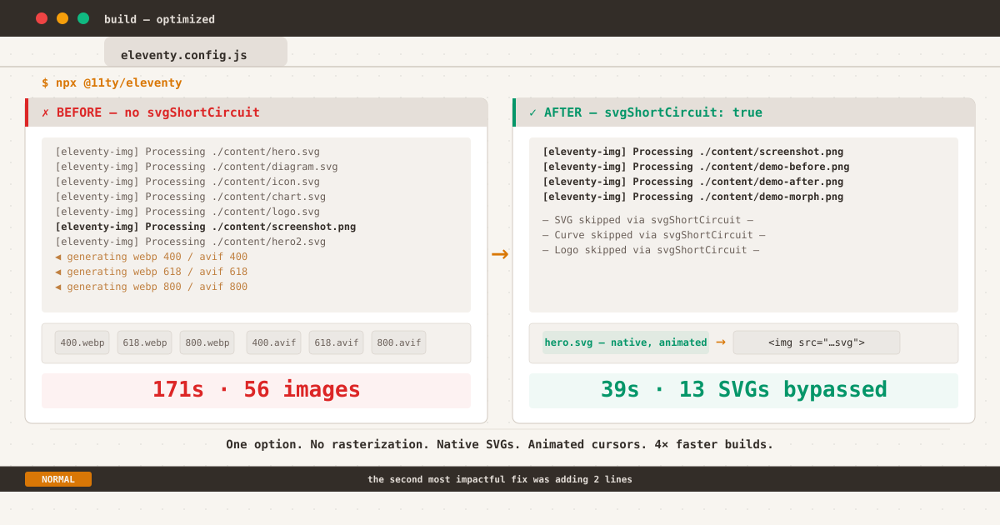

*Before vs after: 171 seconds of unnecessary SVG rasterization versus 39 seconds with svgShortCircuit*

${toc}

## The Sequel

[Last time](/posts/the-plugin-that-was-never-running/), I told the story of how the Eleventy image transform plugin had never actually run on my site. The culprit was a misnamed `extensions` option that registered the plugin for file extensions that didn't exist in my output.

When I finally fixed it, the build spat out this:

```
[11ty/eleventy-img] 45 images optimized
[11ty] Copied 77 Wrote 73 files in 44.29 seconds
```

Forty-five images. Fixed. I closed the laptop, satisfied.

But something kept nagging at me. Forty-five images optimized — but how many of them were SVGs?

## The File Cabinet Problem

Here's what I didn't think about at the time: `eleventyImageTransformPlugin` doesn't discriminate. Every `` tag it encounters gets processed through Sharp — the same Node.js library that powers image optimization services. Sharp reads the image, decodes it, and re-encodes it into whatever formats you've specified.

For a PNG screenshot, that makes sense. For a JPEG photo, absolutely.

For a 5KB vector graphic? Not so much.

I realized what was happening when I ran `find _site -name "*.webp"` after a clean build. Buried among the expected raster variants were files like:

```
_site/posts/all-in-monospace/all-in-monospace-400.webp
_site/posts/all-in-monospace/all-in-monospace-618.webp
_site/posts/all-in-monospace/all-in-monospace-800.webp
_site/posts/all-in-monospace/all-in-monospace-400.avif
_site/posts/all-in-monospace/all-in-monospace-618.avif
_site/posts/all-in-monospace/all-in-monospace-800.avif
```

Six files. For one SVG. And there are forty-two SVGs on this site.

I was generating over 200 raster files from vector sources that had no business being rasterized in the first place. The plugin wasn't malfunctioning — it was functioning *too well*, doing exactly what I had configured it to do. It turns every image into every format at every width. That's its job.

The problem was my config: it treated SVGs like any other image.

## The Cost

Each SVG hero image (1200×630, around 5–15KB) was generating six raster variants at three widths and two formats. A 10KB SVG would produce:

| Variant | Size |
|---------|------|
| hero-400.webp | ~18KB |
| hero-618.webp | ~28KB |
| hero-800.webp | ~38KB |
| hero-400.avif | ~14KB |
| hero-618.avif | ~24KB |
| hero-800.avif | ~32KB |
| **Total** | **~154KB** |

That's 15× the original file size. For images that should have stayed vectors.

The build time tell the story. The "45 images optimized" count was misleading — it counted two PNG screenshots plus the initial SVG pass, but the Sharp pipeline was processing every SVG through metadata extraction, dimension calculation, format conversion, and file writing. Each SVG took Sharp a fraction of a second, but multiplied by 42 SVGs at 3 widths and 2 formats, those fractions added up.

The full build: **171 seconds**. Two minutes and fifty-one seconds. Every time.

## Reading the Source Code (Again)

The first time I read the plugin's source, I was looking for why it *wasn't* running. This time I was looking for why it was running *too hard*.

The answer was hiding in `global-options.js`:

```js
// Via https://github.com/11ty/eleventy-img
svgShortCircuit: false,
svgAllowUpscale: true,
```

`svgShortCircuit`. The name tells you everything. When the input is an SVG and `svgShortCircuit` is `true`, the plugin takes a shortcut: it reads the SVG, extracts its dimensions, records the stats, and stops. No rasterization. No format conversion. Just metadata and a copy operation.

But `svgShortCircuit` only works if SVG is in the `formats` array. Look at the processing loop in `image.js`:

```js
for(let outputFormat of outputFormats) {
    if(outputFormat === "svg") {
        if(entryFormat === "svg") {
            let svgStats = this.getStat("svg", metadata.width, metadata.height);
            results.push(svgStats);

            if(this.options.svgShortCircuit === true) {
                break;  // ← no rasterization
            }
        }
    } else {
        // generate webp, avif, etc.
    }
}
```

The loop iterates over output formats. When it encounters `"svg"` as an output format and the input is also SVG, it can `break` — skip the remaining formats (WebP, AVIF) entirely.

But if SVG isn't in the `formats` array, the `"svg"` branch never executes. The loop only sees `"avif"` and `"webp"`, and generates both for every input — including SVGs.

My old config: `formats: ["avif", "webp"]`. SVG not in the list. The `break` condition never triggered.

## The Fix

Two changes:

1. **Add `"svg"` to the formats array** — gives the plugin permission to handle SVGs as SVGs
2. **Set `svgShortCircuit: true`** — tells it to stop after SVGs are handled, don't generate raster variants

```diff
  eleventyConfig.addPlugin(eleventyImageTransformPlugin, {
-   formats: ["avif", "webp"],
+   formats: ["svg", "avif", "webp"],
+   svgShortCircuit: true,
    defaultAttributes: {
      decoding: "auto",
    },
  });
```

The order matters. SVG comes first in the array. When the plugin encounters an SVG file, it processes the `"svg"` format first, and `break`s before reaching `"avif"` or `"webp"`. For PNG inputs, SVG format is skipped (entry format doesn't match), and the loop continues to AVIF and WebP as normal.

It's a one-line addition and a one-line change. Three seconds of editing. One hundred thirty-two seconds shaved off every build.

## The Impact

The most immediate effect: my SVG hero images are now served as actual SVGs.

```html
<!-- BEFORE (the plugin was working too hard) -->
<picture>
  <source type="image/avif" srcset="…">
  
</picture>

<!-- AFTER (native SVG, no rasterization) -->

```

No `<picture>`. No format fallback. No lossy compression on a vector graphic. The SVG goes directly to the browser, which renders it natively — at whatever resolution the display happens to be.

This matters more than you'd think:

- **Retina displays**: a rasterized SVG at 400px wide looks blurry on a 2× screen. A native SVG renders at the display's full resolution, every time.
- **Zoom**: pinch-to-zoom on a raster WebP shows pixels. On an SVG, everything stays sharp.
- **Animations**: I had `<animate>` elements in several hero SVGs — cursor blinks, pulsing indicators. Rasterization killed them all. They work again.
- **File size**: serving the original 5–15KB SVG instead of 150KB+ of raster variants is better for everyone.

For the PNG screenshots and other raster images, nothing changed. They still get AVIF and WebP at multiple widths, wrapped in `<picture>` with proper `srcset`. The config is smarter about *which* images to process, not less aggressive.

| Metric | Before (Part 1 fix) | After (svgShortCircuit) |
|--------|-------------------|------------------------|
| Raster images with responsive formats | 45 | 2 PNGs (correct) |
| SVGs rasterized unnecessarily | 42 | 0 |
| Generated WebP/AVIF from SVGs | 200+ | 0 |
| Build time (cold) | 171s | 39s |
| SVG animations | broken (rasterized) | working |
| Retina sharpness | lost (400px raster) | perfect (vector) |
| Config complexity | moderate | minimal |

## The Animations I Almost Lost

This was the moment it really hit me.

I opened one of the posts I'd rewritten the hero SVG for — the one with the blinking terminal cursor, the pulsing accent in the corner, the entire design built on the idea that *vectors can move*. I had written the SVG months ago, carefully timing the `<animate>` durations so the cursor blinked at the same rhythm as a real terminal.

With the plugin processing everything through Sharp, that cursor was frozen. Sharp doesn't animate. It captures the first frame and outputs a static image.

I hadn't noticed because — well, who watches their own hero image for three seconds looking for a cursor blink? But it was gone. All that attention to detail, erased by an optimization that the image never needed.

When `svgShortCircuit` kicked in, the cursor blinked again. A tiny thing. But it reminded me that optimizations have blind spots. The plugin was built for photographs and screenshots — images that benefit from compression. Applying it to SVGs was like running a spell-checker on a photograph.

## The Numbers That Matter

Before the fix, my full production build took **171 seconds** and reported "56 images optimized" — most of them unnecessary SVG rasterizations.

After `svgShortCircuit`, the same build takes **39 seconds** and processes exactly the images that need processing: the PNG screenshots. The "56 images optimized" count is misleading when 42 of them are SVGs that should never have been in the pipeline.

| Image type | Count | Before | After |
|------------|-------|--------|-------|
| SVG heroes | 13 | 78 files (6 variants each) | 13 files (1:1 copy) |
| Other SVGs | 29 | 174 files (6 variants each) | 29 files (1:1 copy) |
| PNG screenshots | 2 | 12 files (6 variants each) | 12 files (6 variants each) |
| PNG demos | 3 | 18 files (6 variants each) | 18 files (6 variants each) |
| **Total** | **47** | **~282 files** | **~72 files** |

That's 210 fewer files generated per build. For a site with 36 posts.

## The Real Config

The complete config, after both the Part 1 fix and this optimization:

```js
eleventyConfig.addPlugin(eleventyImageTransformPlugin, {
    formats: ["svg", "avif", "webp"],
    widths: [400, 618, 800],
    svgShortCircuit: true,
    defaultAttributes: {
        decoding: "auto",
        sizes: "(min-width: 680px) 618px, 92vw",
    },
    filenameFormat: (id, src, width, format) => {
        const srcName = path.parse(src).name;
        return `${srcName}-${width}.${format}`;
    },
});
```

The `loading` and `fetchpriority` attributes are handled by a separate transform (covered in [Part 1](/posts/the-plugin-that-was-never-running/#bonus-round-lighthouse-lcp)). Keeping them out of `defaultAttributes` lets the transform make smarter decisions per-page.

## Key Takeaways

1. **"Optimized" doesn't mean optimized for everything.** The plugin reported 56 images processed. But 42 of them were SVGs that should have been left alone. Question the numbers your tools report — they measure activity, not value.

2. **Default options exist for a reason, but they assume use cases.** The `svgShortCircuit` default is `false` because the plugin can't know your site's image makeup. If you have mostly raster images, the default works. If you have vectors, you need to opt in.

3. **Animations are invisible to static analysis.** I didn't notice the missing cursor blink because it wasn't in any Lighthouse report or performance metric. It was a quality-of-experience detail that fell through the cracks of an otherwise excellent tool.

4. **The best optimization is the one you don't run.** Every SVG rasterization was CPU time, disk I/O, and build latency that produced an inferior result. The fastest code is the code that doesn't execute.

5. **Two-part debugging journeys are surprisingly common.** The first part is making something work. The second part is making it work efficiently. Don't stop at "it works" — check what it's actually doing.

## TL;DR

The `eleventyImageTransformPlugin` processes every image format you specify for every image it finds — including SVGs that should remain vectors. Adding `"svg"` to the `formats` array and setting `svgShortCircuit: true` tells the plugin to serve SVGs natively, skipping Sharp rasterization entirely. Build time dropped from 171s to 39s. Cursor animations work again. Retina displays get sharp vectors. And two lines of config fixed what six months of "optimized" builds couldn't.

```diff
  eleventyConfig.addPlugin(eleventyImageTransformPlugin, {
-   formats: ["avif", "webp"],
+   formats: ["svg", "avif", "webp"],
+   svgShortCircuit: true,
    defaultAttributes: {
      decoding: "auto",
    },
  });
```

The most impactful fix I'll make this year was adding two lines.
